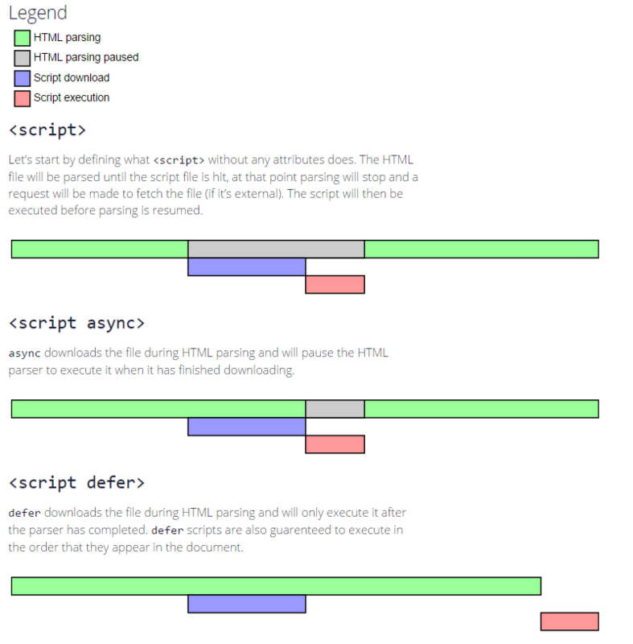

# script元素

## ★script元素的诞生

你知道的，**✎：**

> 向 HTML 页面中插入 JavaScript 的主要方法，就是使用 ``。原来已经不推荐这个type了啊！因为，**✎：**

> 服务器在传送 JavaScript 文件时使用的MIME 类型通常是 application/x–javascript ，但在 type 中设置这个值却可能导致脚本被忽略。

保险起见，看来日后不能这样写了啊！反正没有指定这个属性，其默认值仍为`text/javascript` 。

`charset` 这个值是可选的。表示通过 src 属性指定的代码的字符集！少用，毕竟大多数浏览器会忽略这个值，不过就是没有被废除的赶脚！

## ★使用script元素只有两种姿势

1. 直接在页面中嵌入 JavaScript 代码
2. 添加src属性引入外部 JavaScript文件

需要留心的，**✎：**

1. 包含在 ``" 字符串。为什么？因为这不符合解析嵌入式代码的规则啊！所以你可以通过[转义字符](https://baike.baidu.com/item/%E8%BD%AC%E4%B9%89%E5%AD%97%E7%AC%A6) `\`解决这个问题！

3. 与解析嵌入式 JavaScript 代码一样，在解析外部 JavaScript 文件（包括下载该文件）时，页面的处理也会暂时停止。（书中并没有提到代码是不是从上至下依次解释的！应该是一致的哈！）
4. XHTML支持`<script/>`，不过不能在 HTML 文档使用这种语法，因为这种语法不符合 HTML 规范

## ★你需要知道的

> 按照惯例，外部 JavaScript 文件带有.js扩展名。但**这个扩展名不是必需的**，因为
> 浏览器不会检查包含 JavaScript 的文件的扩展名。这样一来，使用 JSP、PHP 或其他
> **服务器端语言动态生成 JavaScript 代码也就成为了可能**。但是，**服务器通常还是需要**
> **看扩展名决定为响应应用哪种 MIME 类型。如果不使用.js 扩展名，请确保服务器能**
> **返回正确的 MIME 类型。**

总之就添上扩展名好了！

有了src属性还有嵌入式demo？——只会下载并执行外部脚本文件，嵌入的代码会被忽略。

通过 `<script> `元素的 src 属性还可以包含来自外部域的 JavaScript 文件——这就是所谓的JSONP的实现原理啊！不过这是强大与风险并存的src属性！这一点和``很相似，因为它的 src属性也是指向当前 HTML 页面所在域之外的某个域中的完整 URL。

所以，**✎：**

> 如果想包含来自不同域的代码，则要么你是那个域的所有者，要么那个域的所有者值得信赖。不然你的页面就很危险了啊！谁知道这是不是恶意脚本呢！

还有一点就是，**✎：**

1. 无论如何包含代码，只要不存在 defer 和 async 属性，浏览器都会按照`<script>` 元素在页面中
   出现的先后顺序对它们依次进行解析。

   即同步的 `<script>`的元素，形象一点就是后面的 同胞`script`元素不要插队哈！等前面的兄弟姐妹们解析执行完毕后，才轮到你们！

## ★小结

- 关于`type`属性的值，在非IE的浏览器中还可以使用其它值，然而**考虑到约定俗成和最大限度的浏览器兼容性**，目前 `type` 属性的值依旧还是`text/javascript`

  虽然这样做也行，但是这不科学啊！——约定俗成<=>科学、随意！

  所以还是随大众好了！

## ★Q&A

### **①标签？元素？一个意思？**

**➹：**[标签、元素、属性、样式的关系与区别 - CSDN博客](https://blog.csdn.net/pleasecallme_522/article/details/52088087)

1. `
`这就是一个标签

2. `
这里是内容
`这就是一个元素

   > 元素由一个开始的标签和结束的标签组成，用来包含某些内容； 而**单标签则是个例外**。如 ` `，它既是开始标签也是结束标签，而且不包含任何内容，so 这只是个标签而已

   总之，标签就是用来标记HTML元素的。 

3. 属性，**✎：**

   > 为html元素提供各种附加信息的就是属性，它总以**“属性名=属性值”**这种名值对的形式出现，而且属性总是在**HTML元素的开始标签中**进行定义

   额，说到属性，就是key和与之相应的value这个整体了啊！

### **②defer和async？**

**➹：**[javascript - defer和async的区别 - SegmentFault 思否](https://segmentfault.com/q/1010000000640869)

没想过，脚本执行了，HTML解析就中断了啊！

还有就是下载和执行是两码事啊！

还有就是脚本下载完才会去执行？我一直以为可以下载一点执行一点！

我测试了一下，这跟浏览器有关，也跟脚本的书写书写顺序有关！总之图中的结论不是那么准确的！

如果只看chrome的话，那么一个文件中，关于脚本的执行顺序就是，**✎：**

本地→☞defer→☞async

ps：这里的本地放在最后面，而defer和async谁在前谁在后都行

总之你操作dom就把JavaScript-demo 放在 `</body> `前面……浏览器不是100%支持实现html5规范的！

再次认识，**✎：**

**➹：**[彻底搞懂 async & defer · Issue #8 · xiaoyu2er/blog](https://github.com/xiaoyu2er/blog/issues/8)

### ③DOMContentLoaded

**➹：**[DOMContentLoaded - 事件类型一览表 | MDN](https://developer.mozilla.org/zh-CN/docs/Web/Events/DOMContentLoaded)

**➹：**[你不知道的 DOMContentLoaded](https://zhuanlan.zhihu.com/p/25876048)

