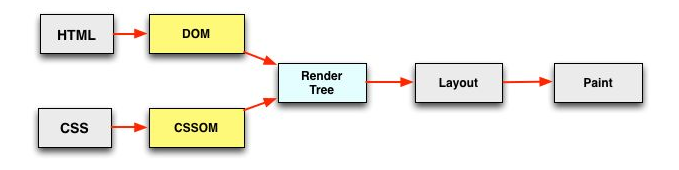
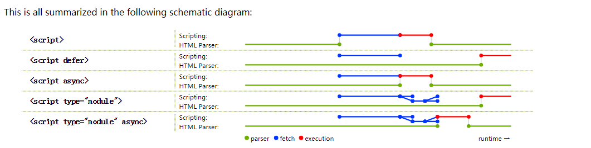

# script元素

## ★标签的位置

像CSS文件那样放到head里面？——不行，因为浏览器是在遇到 `<body>`标签时才开始呈现内容，如果你的页面需要很多JavaScript代码，那么在JavaScript代码下载解析执行期间，整个页面都是空白的啊！

所以你得把你的 `<script>`扔到 `</body>`的前面才行，即等页面的内容完全呈现后，才开始下载解析执行JavaScript代码。

这对用户体验，**✎：**

> 用户会因为浏览器窗口显示空白页面的时间缩短而感到打开页面的速度加快了

那么问题来了，为啥CSS的link标签、style标签得写在head里面？难道就没有加载速度的问题吗？

**➹：** [style标签写在body后与body前有什么区别? - 知乎](https://www.zhihu.com/question/39840003)

**➹：**[原来 CSS 与 JS 是这样阻塞 DOM 解析和渲染的 - 掘金](https://juejin.im/post/59c60691518825396f4f71a1)

**➹：** [关键渲染路径  |  Web  |  Google Developers](https://developers.google.com/web/fundamentals/performance/critical-rendering-path/?hl=zh-cn)

我稍微看了一下，有了几点认识，**✎：**

1. 浏览器是解析`DOM`生成`DOM Tree`，结合`CSS`生成的`CSS Tree`，最终组成`render tree`，再渲染页面。（这点总结的倒为简洁明了）
2. 关于阻塞的对象，有`DOM` 的解析和页面的渲染
3. 是否应该去看W3C呢？还是写各种玩具示例然后总结出一些未必普适的规律呢？（在我看来结果出来了就ok了！😏，而且所谓的规范浏览器会100%遵循吗？😂可是难道还得看看这所谓的「基本法」？💔）

## ★延迟脚本

HTML 4.01 为` <script> `标签定义了 defer 属性，此属性会让脚本会被延迟到整个页面都解析完毕后再运行。

总之在 `<script> `元素中设置defer 属性，相当于告诉浏览器立即下载，但延迟执行。

如果一个页面有2个defer脚本——A和B？你说哪个先执行？

根据HTML5 规范要求脚本按照它们出现的先后顺序执行

所以第一个延迟脚本会先于第二个延迟脚本执行，而这两个脚本会先于 DOMContentLoaded 事件

**➹：** [DOMContentLoaded与load的区别 - CaiBoBo - 博客园](https://www.cnblogs.com/caizhenbo/p/6679478.html)

然而在现实当中，延迟脚本并不一定会按照顺序执行，也不一定会在 DOMContentLoaded 事件触发
前执行，因此**最好只包含一个延迟脚本**

ps： defer 属性只适用于外部脚本文件。这一点在 HTML5 中已经明确规定，因此支持HTML5 的实现会忽略给嵌入脚本设置的 defer 属性。

为了兼容老版本的浏览器（有些浏览器会忽略这个defer属性，像平常一样处理脚本），所以把延迟脚本放在页面底部仍然是最佳选择！

原来如此啊！这倒是一个很合理的理由！

**✎：**

> 在 XHTML 文档中，要把 defer 属性设置为 defer="defer" 

然而目前已经不需要考虑XHTML吧！都已经是2018年了！

## ★异步脚本

HTML5 为` <script> `元素定义了 async 属性。这个属性与 defer 属性类似，都用于改变处理脚本的行为。

async与defer的区别，**✎：**

- 共同点：
  1. 只适用于外部脚本文件，并告诉浏览器立即下载文件
- 不同点：
  1. 标记为 async 的脚本并不保证按照指定它们的先后顺序执行，这意味着一个页面存在两个都被async标记的脚本不一定会按照先来先到原则执行！

所以两个async脚本之间互不依赖非常重要

为啥要用async呢？

**为了不让页面等待脚本下载和执行，从而异步加载页面其他内容！为此，建议异步脚本不要在加载期间修改 DOM**

async脚本的执行顺序，**✎：**

1. **一定**会在页面的 load 事件前执行

   **➹：**[(1) 前端知识普及之页面加载 - 前端的bigboom - SegmentFault 思否](https://segmentfault.com/a/1190000004466407)

   之前有了解过，下载完毕后就解析执行，其中解析执行肯定得要阻塞页面加载的啊！只不过下载这个资源是异步摆了！

2. 可能会在 DOMContentLoaded 事件触发之前或之后执行

对于支持异步脚本的浏览器？——总之目前已经不需要去考虑兼容了吧！

[Can I use... Support tables for HTML5, CSS3, etc](https://caniuse.com/#search=async)

同理，**✎：**

> 在 XHTML 文档中，要把 async 属性设置为 async="async" 。

## ★在XHTML中的用法

>  HTML5 正快速地被前端开发人员采用，建议读者在学习和开发中遵循 HTML5 标准，本节内容可以跳过。

那好吧！我有这两个认识就可以了，**✎：**

1. 可扩展超文本标记语言，即 XHTML（Extensible HyperText Markup Language），是将 HTML 作为
   XML 的应用而重新定义的一个标准。
2. 编写 XHTML 代码的规则要比编写 HTML 严格得多

ps：有hack关键字出现！

**✎：**

> 在将页面的 MIME 类型指定为 "application/xhtml+xml" 的情况下会触发XHTML 模式。并不是所有浏览器都支持以这种方式提供 XHTML 文档。

🙋

## ★不推荐使用的语法

- 规则的冲突
  - 最初的时候，` <script>` 元素与传统 HTML 的解析规则是有冲突的
  - ` <script>` 元素有其特殊的解析规则
- 不要对内部脚本添加HTML注释！因为目前所有浏览器都已经支持 JavaScript，因此也就没有必要再使用这种格式了

## ★小结

- 你需要去理解defer和async的区别
- 你需要明白，script的摆放位置以及css为啥非要放到head里

### ①阻塞为何意啊？

**➹：**[什么是阻塞，非阻塞，同步，异步？ - 知乎](https://www.zhihu.com/question/26393784)

### ②平稳退化？

**➹：**[不是要遵守“循序渐进”和“平稳退化”么？为什么这些大站都不遵守。 - 知乎](https://www.zhihu.com/question/31173107)

**➹：**[渐进增强与平稳退化 - 简书](https://www.jianshu.com/p/f1f1172e273f)

### ③load和DOMContentLoaded？

1. 在任何情况下，DOMContentLoaded 的触发不需要等待图片等其他资源加载完成。
2. load，页面上所有的资源（图片，音频，视频等）被加载以后才会触发load事件，简单来说，页面的load事件会在DOMContentLoaded被触发之后才触发。

[MDN](https://developer.mozilla.org/zh-CN/docs/Web/Events/DOMContentLoaded)补充，**✎：**

1. 当初始的 **HTML** 文档被完全加载和解析完成之后，**DOMContentLoaded** 事件被触发，而无需等待样式表、图像和子框架的完成加载。
2.  另一个不同的事件 `load `应该仅用于检测一个完全加载的页面。

ps：**DOMContentLoaded** 事件必须等待**其所属script之前的样式表加载解析**完成才会触发。

补充，**✎：**

**➹：**[你不知道的 DOMContentLoaded](https://zhuanlan.zhihu.com/p/25876048)

给我的几点认识，**✎：**

1. 衡量一个网页加载速度的一个方法就是“计算这个网页从空白到出现内容所花费的时间”（这个是作者个人认为的，当然我也非常赞同）

2. 那怎么计算这段时间？[HTML5 规范](https://link.zhihu.com/?target=https%3A//www.w3.org/TR/html5/syntax.html%23the-end)已经帮我们完成了相应的工作，就是当一个 HTML 文档被加载和解析完成后，DOMContentLoaded 事件便会被触发。

   （我之前看浏览器的工作原理，了解到，渲染不是一步做到的，而是源源不断地，我就在想这个事件是所有内容显示完后就触发，还是有内容出现就触发呢？）

   **现在问题是所谓的加载和解析完成指的是DOM树的完全构建吗？还是render tree 完全构建？你要知道页面内容的出现是渐进的，这意味着DOM的解析也是渐进的！**

   简单看看一幅图，**✎：**

   

   **我已有的认为，内容的渲染不是一步登天的！**

3. 如果脚本横插一脚，那么，**✎：**

   1. 在 DOM、CSSOM 构建完毕，defer 脚本执行完成之后，DOMContentLoaded 事件触发。
   2. 如果 script 标签中包含 async，则 HTML 文档构建不受影响，解析完毕后，DOMContentLoaded 触发，而不需要等待 async 脚本执行、样式表加载等等。

   **➹：**[async vs defer attributes - Growing with the Web](https://www.growingwiththeweb.com/2014/02/async-vs-defer-attributes.html)

4. 结论，**✎：**

   当 HTML 文档解析完成就会触发 DOMContentLoaded，而所有资源加载完成之后，load 事件才会被触发。

5. 扩展，**✎：**

   1.  jQuery 中经常使用的 `$(document).ready(function() { // ...代码... })`; 其实监听的就是 DOMContentLoaded 事件
   2. 而 `$(document).load(function() { // ...代码... })`; 监听的是 load 事件。

6. 我的认识，**✎：**

   看到文章中所提到的这个链接

   **➹：**[DOMContentLoaded](https://testdrive-archive.azurewebsites.net/HTML5/DOMContentLoaded/Default.html)

   1. 内容的出现是边解析边渲染的

7. 再次认识，**✎：**

   1. async与DOMContentLoaded的那些事儿，**✎：**

      > 添加了 async 标签的脚本加载完毕的时间无非有两种情况，一种是 HTML 还没有被解析完，那么 HTML 停止解析，去执行脚本；另一种是 HTML 解析完毕，直接去执行脚本。而 DomContentLoaded 事件只关注 HTML 是否被解析完，而不管 async 脚本。

      > 文档解析完成的同时刚好有个脚本（async）也加载完成了，那么是不需要等待脚本（async）执行的，直接 DOMContentLoaded 触发 。

   2. defer与DOMContentLoaded的那些事儿，**✎：**

      > 如果script中使用defer属性，表明在HTML解析完成后才执行js的内容，这时候的HTML已经解析完成了，为什么不直接触发DOMContentLoaded事件，而是等待 CSSOM 构建完成和defer脚本的执行完成后才触发DOMContentLoaded事件？

   3. defer和async，**✎：**

      

      **➹：**[defer](https://html.spec.whatwg.org/multipage/scripting.html#attr-script-defer)

### ④user agent？

我所理解的就是，帮用户发起请求的浏览器，当然不单只是浏览器，别忘了终端也可发起请求的，这是的用户代理就是终端了啊！

总之帮用户发请求的东西就是agent（代理）

**➹：**[浏览器User-Agent（用户代理）的介绍-明氪的家园-51CTO博客](http://blog.51cto.com/mingkrcom/1434091)

**➹：** [认识User-Agent - CSDN博客](https://blog.csdn.net/rj042/article/details/6991441)

