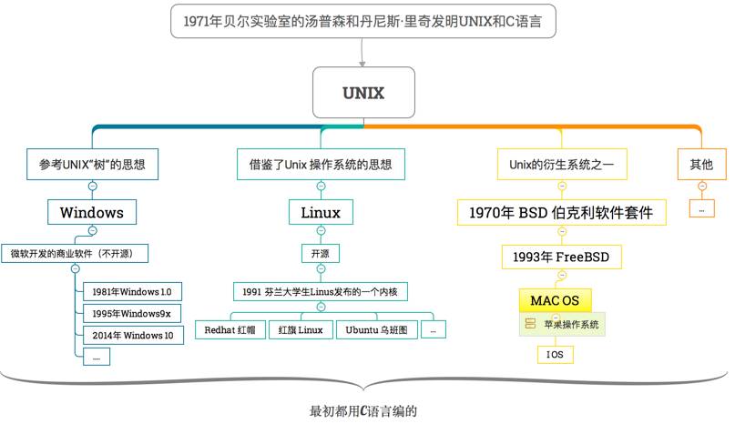

# 语法

## ★前言

> ECMAScript 的语法大量借鉴了 C 及其他类 C 语言（如 Java 和 Perl）的语法。因此，熟悉这些语言
> 的开发人员在接受 ECMAScript 更加宽松的语法时，一定会有一种轻松自在的感觉。

没有吧！有时候JavaScript会让你很抓狂:smile:，比如this、闭包……

## ★区分大小写

> 要理解的第一个概念就是 ECMAScript 中的一切（**变量、函数名和操作符**）都区分大小写

ps：关键字不能用作函数名，如`typeof`，而`typeOf`则是可以的！

## ★标识符

### ◇概念

> 所谓标识符，就是指变量、函数、**属性的名字**，或者**函数的参数**。

### ◇怎样才能算是一个标识符

按照下列格式规则组合起来的一或多个字符，就是一个标识符了，**✎：**

1.  第一个字符必须是一个字母、下划线（ _ ）或一个美元符号（ $ ）
2. 其他字符可以是字母、下划线、美元符号或数字

**➹：**[★为什么计算机语言中的变量名都不能以数字开头呢？ - 知乎](https://www.zhihu.com/question/19581495)

**➹：**[Linux Windows等操作系统文件名命名规范 - Robinson - ITeye博客](http://robinson.iteye.com/blog/894099)

不要把这个标识符的命名规则当作是文件、目录的命名规则啊！文件、目录还是可以用数字开头的哈！反正我一般的命名来来去去都是那几个字符，如 数字、-、字母、中文字符……

### ◇一种最佳实践

> 按照惯例，ECMAScript 标识符采用**驼峰大小写**格式，也就是第一个字母小写，剩下的每个单词的首字母大写

**✎：**

1. myCar
2. doSomething

这种格式不是强制性要求的，但是为了**与 ECMAScript 内置的函数和对象命名格式保持一致**，可以将其当作一种**最佳实践**。

**➹：**[驼峰命名法有什么优点，为什么要用？ - 知乎](https://www.zhihu.com/question/62610697)

**➹：**[为什么很多人不建议使用驼峰命名法，有什么弊端么？ - 知乎](https://www.zhihu.com/question/20305894)

**➹：**[web前端开发class命名、id命名、js中变量命名、图片命名使用下划线还是驼峰法还是连字符？ - 知乎](https://www.zhihu.com/question/41800935)


### ◇敲黑板

> 不能把关键字、保留字、 true 、 false 和 null 用作标识符

**➹：**[★保留字 - 维基百科，自由的百科全书](https://zh.wikipedia.org/wiki/%E4%BF%9D%E7%95%99%E5%AD%97)


## ★注释

### ◇有哪些注释的姿势？

> ECMAScript 使用 C 风格的注释，包括单行注释和块级注释。

它们长啥样呢？

- 单行注释以两个斜杠开头

  ```js
  // 单行注释
  ```

- 块级注释以一个斜杠和一个星号（ /* ）开头，以一个星号和一个斜杠（ */ ）结尾

  ```js
  /*
  * 这是一个多行
  * （块级）注释
  */
  ```

  为啥多了两个`*`?

  > 这不是必需的，之所以添加那两个星号，纯粹是为了**提高注释的可读性**（这种格式在**企业级应用中用得比较多**）

## ★严格模式

### ◇哪个阶段引入的？

> ECMAScript 5 引入了严格模式（strict mode）的概念

### ◇为什么要引入？

> 严格模式是为 JavaScript 定义了一种**不同的解析与执行模型**

我只知道在使用this的时候会有很直观的体现！

> 在严格模式下，ECMAScript 3 中的一些**不确定的行为将得到处理**，而且对某些**不安全的操作也会抛出错误**。

### ◇怎么引入？

- 在整个脚本中启用严格模式，可以在顶部添加如下代码：

  ```javascript
  "use strict";
  ```

  原理，**✎：**

  > 这行代码看起来像是字符串，而且也没有赋值给任何变量，但其实它是一个**编译指示**（pragma），
  > 用于**告诉支持的 JavaScript 引擎切换到严格模式**。这是为不破坏 ECMAScript 3 语法而特意选定的语法。

  这个pragma也有注解之意！

- 指定函数在严格模式下执行，在函数内部的上方添加

  ```javascript
  function doSomething(){
      "use strict";
      //函数体
  }
  ```

### ◇兼容性

> 严格模式下，**JavaScript 的执行结果会有很大不同**，因此本书将会随时指出严格模式下的区别

> 支持严格模式的浏览器包括 IE10+、Firefox 4+、Safari 5.1+、Opera 12+和 Chrome。

目前需要兼容IE9及其以下的浏览器吗？

[国内有哪些不需要兼容低版本ie的前端团队？ - 知乎](https://www.zhihu.com/question/39505937)

IE6和IE7铁定是不要去考虑的！所以你看着办吧！，总之就是，**✎：**

> 需不需要兼容 legacy IE，是由业务需求（产品线）决定的。

### ◇日常写demo得要用严格模式吗？

**➹：**[写js时候，需要用到严格模式（strict mode）吗? - 知乎](https://www.zhihu.com/question/39767497)


## ★语句

### ◇如何判断这厮是语句？

> ECMAScript 中的语句以一个分号结尾；如果省略分号，则由解析器确定语句的结尾。

**✎：**

```js
var sum = a + b // 即使没有分号也是有效的语句——不推荐
var diff = a - b; // 有效的语句——推荐
```

### ◇是否 要写`；`？

我平时写demo都不写 这个`；`的，可是看了写了它的种种好处，我的内心开始动摇了，**✎：**

> 此书建议任何时候都不要省略它，即便语句结尾的分号不是必需的……

1. 可以避免很多错误（如不完整的输入）
2. 可以放心地通过删除多余的空格来压缩 ECMAScript 代码（代码行结尾处没有分号会导致压缩错误）
3. 在某些情况下增进代码的性能，因为这样解析器就不必再花时间推测应该在哪里插入分号了

### ◇如何「打包」多条语句？

可以使用 C 风格的语法把多条语句组合到一个代码块中，即代码块以左花括号（ { ）开头，以右花括号（ } ）结尾，**✎：**

```js
if (test){
    test = false;
    alert(test);
}
```

关于if的哪些事儿，**✎：**

> 条件控制语句（如 if 语句）只在执行多条语句的情况下才要求使用代码块，但**最佳实践**是**始终在控制语句中使用代码块——即使代码块中只有一条语句**

```js
if (test)
	alert(test); // 有效但容易出错，不要使用
if (test){ // 推荐使用
	alert(test);
}
```

总之，**✎：**

> 在控制语句中使用代码块可以让编码意图更加清晰，而且也能降低修改代码时出错的几率

## ★小结

- 你想要看懂这门语言的demo？——那么首先你得对这门语言的基本语法有个清晰的认识才行！

## ★Q&A

### ①各大操作系统？

**➹：**[一分钟看懂WINDOWS系统、LINUX系统和苹果操作系统到底有什么区别？-盛世阳光](https://www.gonet.com.cn/index.php?webduirshow-166)



### ②驼峰好？还是下划线好？

**➹：**[为什么很多人不建议使用驼峰命名法，有什么弊端么？ - pansz的回答 - 知乎](https://www.zhihu.com/question/20305894/answer/43830295)

> 驼峰一般也就是跟下划线比较的。缺点是：
> 1，阅读困难，加下划线之后词距拉大，相对来说阅读起来轻松些。
> 2，为了做全文搜索，驼峰你必须忽略大小写。而下划线命名法做全文搜索可以区别大小写。很少有人在用驼峰命名时，编辑器搜索区分大小写。而一旦你习惯了不分大小写的设定，会在区分大小写的场合感到不习惯。
>
> 当然，其实也没有绝对的好坏，只是一个取舍而已。项目一致性始终很重要。人家那个项目不建议用驼峰你就别用，人家那个项目规定用驼峰你就用。

竟然如此，那就随缘了，那我平时就是用小驼峰好了！

### ③什么叫做裹脚布代码？

**➹：**[你的代码方法是不是和老太婆的裹脚布一样又长又臭-编程中国社区](http://www.hello-code.com/blog/refactoring/201506/5123.html)

**➹：**[你遇见过哪些烂代码？ - 知乎](https://www.zhihu.com/question/20866659)

给我的几点认识，**✎：**

1. 很多时候我们在重构代码的时候，都在使用短方法，如

   ```js
   //初始化
   A()
   B()
   
   //重构
   function initialize() {
   	A()
   	b()
   }
   ```

2. 有些情况下，可读性和性能是冲突的，但是如果小小的性能牺牲可以换来更高的可读性，我会毫不犹豫地选择可读性。

总之目前我还是得多使用短方法的姿势，就像这个比喻一样，**✎：**

> 部门的组织架构，主管下面有多个项目经理，项目经理下面有多个项目组长，项目组长下面有多个小兵，一个好的主管会把目光聚焦在几个项目经理身上，而不是给每个小兵派具体的任务

同理，你的方法也如此，即**每个方法做一个级别的事情，而不是把所有细节堆到一个方法里面，跟一锅粥一样**。

对了，裹脚布的代码指的是代码又长又乱，可读性差！

### ④IE兼容性？

**➹：**http://tongji.baidu.com/data/browser

这个百度统计一直在**数据正在加载中**，我真是无语了……

**➹：**[ie6 ie7 ie8 ie9兼容问题终极解决方案 - osfipin - 博客园](https://www.cnblogs.com/osfipin/p/6232194.html)

### ⑤孔乙己对学习的启示？

看到这个问题的时候，**✎：**

**➹：**[写js时候，需要用到严格模式（strict mode）吗? - 知乎](https://www.zhihu.com/question/39767497)

其中[有个回答](https://www.zhihu.com/question/39767497/answer/83170595)，是这样说的，**✎：**

> 先搞清原型链 细枝末节上关注的是孔乙己

我已有的认知是孔乙己说的那句话，**✎：**

> 你可知茴字有几种写法？

根据上面的那个回答，我对这句话的理解就是 **什么时候做什么事你得要有个清楚的认识，到了抠细节的时候你得去抠，不然，那就不要在那——和稀泥！**

**➹：**[如何评价孔乙己？ - 知乎](https://www.zhihu.com/question/26985484)

一些话，确实刻骨铭心，**✎：**

1. 稍有人问，你就会敞开心扉，其实就是孤独
2. 间歇性踌躇满志，持续性混吃等死。
3. 在灯光下，你一回头就能看见他（孔乙己）的影子。

### ⑥语句啊！你真得要加分号吗？

**➹：**[JavaScript 语句后应该加分号么？ - 知乎](https://www.zhihu.com/question/20298345)

**➹：**[不写分号的前端攻城师们注意了！需要加分号的情况又多了一种](https://zhuanlan.zhihu.com/p/24612490)

分号什么时候加？什么时候不加？

> 真正会导致上下行解析出问题的 token 有 5 个：括号，方括号，正则开头的斜杠，加号，减号。

即 `( , [ , / , + , - `

目前多了一个 `反引号`

总之，**✎：**

> 一行开头是括号或者方括号的时候加上分号就可以了，其他时候全部不需要。其实即使是这两种情况，在实际代码中也颇为少见

还有就是，**✎：**

> 加与不加是风格问题，风格争议不需要有个定论。

反正你就具体情况就加上，日常一般都是不需要加的！

除非，**✎：**

1. 在一些语句中，分号是必不可少的。如for循环语句中的分号，否则会报语法错误。还有在多层嵌套中有时在其中一个以 } 结束的语句中忘了加分号，有时就会出错了
2. 正则和减号在三目运算时候会出现

### ⑦code review?

**➹：**[代码审查 - 维基百科，自由的百科全书](https://zh.wikipedia.org/wiki/%E4%BB%A3%E7%A0%81%E5%AE%A1%E6%9F%A5)

**➹：**[大家的公司的 Code Review 都是怎么做的？遇到过哪些问题？ - 知乎](https://www.zhihu.com/question/41089988)

初认识，**✎：**

[Tim Chen](https://www.zhihu.com/question/41089988/answer/89651601)

> Code Review的目的除了**提高代码质量，提前发现bug**外，还包括统一团队的**代码规范**，比如经常会碰到有人说你这个变量命名不对，或者这里缩进不应该用tab，甚至这里应当多加一个空白行。而类似架构或者设计模式这样的“大”问题，我个人觉得并不适合在code review的时候去讨论。如果这方面有问题，那说明之前design review没有做好或者有可能根本没有做design review。

没想到还有个design review……

### ⑧JSLint？

这是JavaScript校验工具的一种。

为什么出现呢？

你遇到过「变量命名不正确、产生语法错误以及忘记正确处理错误」这些问题吗？

这就是它为什么出现的原因

总之，好的校验工具可以确保一个项目遵循代码规范！

推荐使用ESLint！因为**ESLint对ES6支持的最广泛**

