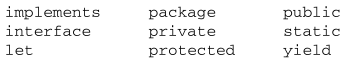

# 关键字和保留字

## ★已有的认识

我认为它们俩是一个意思

## ★关键字

- 能干啥？

  > ECMA-262 描述了一组具有**特定用途**的关键字，这些关键字可用于**表示控制语句的开始或结束**，或者**用于执行特定操作**等……

- 不能干啥？

  > 按照规则，关键字也是语言保留的，**不能用作标识符**

- 目前有哪些是关键字，**✎：**

  

## ★保留字

- 不能干啥与能干啥？

  > ECMA-262 还描述了另外一组**不能用作标识符**的保留字。尽管保留字在这门语言中**还没有任何特定的用途**，但它们有**可能在将来被用作关键字**。

  说白了就是一个备胎，就这么简单！

- 以下是 **ECMA-262 第 3 版**定义的全部保留字，**✎：**

  

  这就有点Java的味道了啊！

- 不同模式下保留字的那些事儿，**✎：**

  - 非严格模式

    - 第 5 版把在非严格模式下运行时的保留字缩减为下列这些，**✎：**

    

  - 那么严格模式呢？

    - 在严格模式下，第 5 版还对以下保留字施加了限制：

    

    ps： **let 和 yield 是第 5 版新增的保留字**；其他保留字都是第 3 版定义的

  - 拿个public来测试

    先拿严格开刀，**✎：**

    

    换一个非严格的，**✎：**

    

## ★测试报错信息

（声明）以下是非严格模式的测试，**✎：**

- 关键字，**✎：**

  

- 保留字，**✎：**

  

  不过有些保留字或许目前已经是关键字了，**✎：**

  

  还有一些比较奇葩的报错哈

  

  ps：使用保留字作标识符**可能会也可能不会**导致相同的错误，具体**取决于特定的引擎**

## ★目前的情形

> **第 5 版**对使用关键字和保留字的**规则进行了少许修改**。关键字和保留字虽然仍然不能作为标识符使
> 用，但现在**可以用作对象的属性名。**一般来说，**最好都不要使用关键字和保留字作为标识符和属性名**，
> 以便与将来的 ECMAScript 版本**兼容**。

这么早就为将来打算了，总之你的标识符就不要出现关键字和保留字就好了！

还有一点就是，**✎：**

> ECMA-262 第 5 版对 eval 和 arguments 还施加了限制。在严格模式下，这两个名字也不能作为标识符或属性名，否则会抛出错误

测试，**✎：**

严格模式下的情形，**✎：**

------

## ★小结

- 学会了2个单词——「reserved」（保留字，可能是现仍也可能是备胎，可以根据报错信息识别）和「unexpected」（没想到吧！），还有就是不要跟「reverse」（反转）给混淆了！

  **➹：**[python3.4 编译时提示错误 IndentationError: unexpected indent - CSDN博客](https://blog.csdn.net/lhshu2008/article/details/25793785)

- 其实就一句话，你的标识符命名从此多了关键字和保留字这两个包袱！不管是未来还是现在，你都不能使用它们俩作为标识符的名字

## ★Q&A

### ①目前ECMAScript规定的关键字和保留字？

**➹：**[Reserved Words - JavaScript | MDN](https://developer.mozilla.org/zh-CN/docs/Web/JavaScript/Reference/Reserved_words)

我看了一下英文版，关键字和保留字的英文分别是，**✎：**

Reserved keywords——保留关键字

Future reserved keywords——将来的保留关键字

总之有个Future，形象一点保留字就是个备胎！

**➹：**[Lexical grammar - JavaScript | MDN](https://developer.mozilla.org/en-US/docs/Web/JavaScript/Reference/Lexical_grammar#Keywords)

