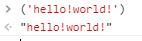
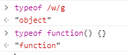

# typeof操作符

哇！它原来是个操作符，我还以为是函数呢……:joy:

## ★为什么需要typeof？

> 鉴于 ECMAScript 是松散类型的，因此**需要有一种手段来检测给定变量的数据类型**—— typeof 就是**负责提供这方面信息**的操作符

## ★用一下typeof？

话说怎么用呢？

`typeof 值`

其返回值是字符串，**✎：**

- "undefined" ——如果这个值未定义；

- "boolean" ——如果这个值是布尔值；

- "string" —— 如果这个值是字符串；
- "number" ——如果这个值是数值；

- "object" ——如果这个值是对象或 null ；
- "function" ——如果这个值是函数

这个值是啥类型的，在这6个字符串中任选一个！

给点例子？**✎：**

```js
var message = "some string";
alert(typeof message); // "string"
alert(typeof(message)); // "string"
alert(typeof 95); // "number"
```

老实说，你加了个括号就像是个函数，不过之前书中有提到过，内置的api是驼峰命名法，可见这里的typeof的o是小写的，所以我就区分了，至于加括号？我看了有一下MDN，`()`它可以被看作是call，用于函数调用，也可以是分组操作符，用于控制了表达式中计算的优先级。

那好吧！在这里很明显这个括号是分组操作符吧！所以这个message加个括号返回还是个字符串咯，就像是这样，**✎：**



书本解释这个例子，**✎：**

> 这几个例子说明， typeof 操作符的操作数可以是**变量**（ message ），也可以是**数值字面量**。注意，
> typeof **是一个操作符而不是函数**，因此例子中的**圆括号尽管可以使用，但不是必需的**。

关于对数值字面量理解，这里数值可不是数字的数，而是数据的数啊！

## ★大智若愚的返回值？

> 有些时候， typeof 操作符会返回一些**令人迷惑但技术上却正确**的值。比如，调用 typeof null会返回 "object" ，因为特殊值 null 被认为是一个空的对象引用。

在Java里，时常会遇到空指针的报错信息！也就是所谓的null，一般如果我给一个变量初始化的话，假设我们想把这个变量看作是个对象，那么会给它的初始值为null，而不是给个undefined！



奇葩的函数！

敲黑板，**✎：**

> 从技术角度讲，函数在 ECMAScript中是对象，不是一种数据类型。然而，函数也确实有一些特殊的属性，因此**通过 typeof 操作符来区分函数和其他对象是有必要的**

无心插柳柳成荫的typeof！

## ★小结

- typeof是个操作符，可不是个函数呀！
- 区分一个变量存储的值是函数还是对象，可以使用typeof！
- null的typeof结果是个对象！

## ★Q&A

### ①松散类型

**➹：** [周明的技术博客-死磕JavaScript-松散类型、js变量存储模型、变量提升](https://zhoum1118.github.io/javascript/2017/05/12/%E6%9D%BE%E6%95%A3%E7%B1%BB%E5%9E%8B-js%E5%8F%98%E9%87%8F%E5%AD%98%E5%82%A8%E6%A8%A1%E5%9E%8B-%E5%8F%98%E9%87%8F%E6%8F%90%E5%8D%87.html)

**➹：** [变量 (JavaScript)](https://msdn.microsoft.com/zh-cn/library/67defydd(v=vs.94).aspx)

**➹：**[JavaScript变量 · JS重塑学习 · 看云](https://www.kancloud.cn/digest/liao-js/149458)

**➹：** [计算机语言可以以变量名作为类型判断么？ - 知乎](https://www.zhihu.com/question/40873269)

所谓松散类型指的变量仅仅是保存值的一个引用，谁知道引用的那头的值是什么鬼的数据类型！

### ②话说操作符与运算符有啥区别？

我目前知道是操作符的有`var`、还有这个`typeof`

**➹：**[操作符和运算符的区别_百度知道](https://zhidao.baidu.com/question/297794878.html)

看看英文先，**✎：**

操作符：**operator**

运算符：**operators**

总不能多了个`s`就是两个名字吧！如果我感性来看的话，**✎：**

操作符是个理科生，而运算符则是个文科生！

**➹：** [javascript--3基本概念 运算符与操作符 - - ITeye博客](http://zhyp29.iteye.com/blog/2303924)

在这篇文里有提到，**✎：**

不会去严格区分它们的区别，可以混用！总之作者开头提到了，**✎：**

> 如果说数据类型是编程语言的砖瓦，那么运算符和操作符则是编程语言的石灰和水泥了，它是将各种数据类型的值有机组合的糅合剂，使得数据值不再只是一个孤立的值，而有了一种动态的灵性。在ECMAScript中，有非常丰富的运算符和操作符……

这样大可认为它们都是为数据服务的！因此从这个角度来说可以不必区分……反正都是一种手段！

**➹：** [表达式和运算符 - JavaScript | MDN](https://developer.mozilla.org/zh-CN/docs/Web/JavaScript/Guide/Expressions_and_Operators)

接着我又看了一下这个，**✎：**

**➹：**[如果理解编程语言中「操作符」（operator）的概念？ - 知乎](https://www.zhihu.com/question/34670236)

其中有个答案说到，**✎：**

>  操作符就是拿来增强语言的表达能力的

所以这就是为啥 `typepf`叫操作符的缘故，它就像是个函数一样！为此欺骗了我一段时间！

总之，我看到的操作符的语义化都比较直观！

ps：当我看到这个，**✎：**


