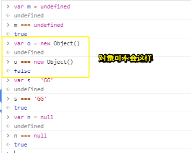
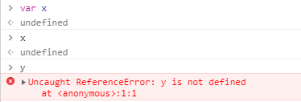
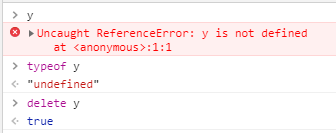
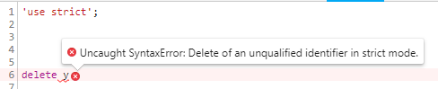
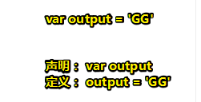

# Undefined类型

## ★我只有一个值！

> Undefined 类型只有一个值，即特殊的 undefined 。

## ★如何拿到这个值？

> 在使用 var 声明变量但未对其加以初始化时，这个变量的值就是 undefined 。

**✎：**

```js
var message;
alert(message == undefined); //true
```

> 这个例子只声明了变量 message ，但未对其进行初始化。

如果我直接赋值，即对其初始化一个undefined字面量呢？**✎：**

```js
var message = undefined;
alert(message == undefined); //true
```

一样是等价的！老实说，这样的测试有点啰嗦！




> 这个例子使用 undefined 值**显式初始化**了变量 message 。但我们**没有必要这么做**，因为**未经初始化的值默认就会取得 undefined 值。**

所以请不要做多余的事儿！如给这个变量一个undefined值！:joy::joy::joy:

## ★为什么会引入undefined这个值？

> 一般而言，不存在需要**显式地**把一个变量设置为 undefined 值的情况。
>
> 字面值undefined 的主要目的是**用于比较**，而 ECMA-262 第 3 版之前的版本中并没有规定这个值。
>
> **第 3 版引入**这个值是**为了正式区分空对象指针与未经初始化的变量**。

也就是我使用了这个值，那就意味着这个变量和未经初始化的变量是有区别的咯！一个是有初始化的，一个是没有初始化的；一个是显示的，一个是隐式的！

关于空对象指针指的是null吧！之前学Java的时候，经常会报空指针异常的错误！而且这个值顾名思义，与对象有光！我猜这是对一个对象初始化的处理吧！也不知道这个null占不占内存，或者相较于 这个对象字面量`{}`占用的少一点！

我一直有的认识是，如果这个变量你打算定义它为对象的话，要给它为空值的话，我会给个null，而不是undefined！为什么？因为我会对这个变量存储的值为对象，而不是简单的数据类型！

## ★尚未定义的变量和已定义的变量

按我的理解，是否定义指的是是否有var声明，我突然想起var所代表的含义应该是「声明并定义」……

总之，**✎：**

> 包含 undefined 值的变量与尚未定义的变量还是不一样的



 `x`这个变量声明之后默认取得了 `undefined` 值。而`y`则未声明并定义！你的如果定义了，即给了个值倒是不会报错！可你既没有var也没有值！

不过天无绝人之路！

> 对于尚未声明过的变量，只能执行一项操作，即使用 typeof 操作符检测其数据类型（对未经声明的变量调用 delete 不会导致错误，但这样做没什么实际意义，而且在严格模式下确实会导致错误）。



严格模式下，**✎：**



而`typeof y`即便在严格模式下依旧如此！

你会发现，这很让人困惑，**✎：**

> 对未初始化的变量执行 typeof 操作符会返回 undefined 值，而对未声明的变量执行 typeof 操作符同样也会返回 undefined 值。

```js
var message; // 这个变量声明之后默认取得了 undefined 值
// 下面这个变量并没有声明
// var age
alert(typeof message); // "undefined"
alert(typeof age); // "undefined"
```

可见，**✎：**

> 对未初始化和未声明的变量执行 typeof 操作符都返回了 undefined 值

然而，**✎：**

> 这个结果有其逻辑上的合理性。因为虽然这两种变量从技术角度看有本质区别，但实际上无论对哪种变量也不可能执行真正的操作。

在我看来这个解释有点牵强了！我认为这是不合理的！

## ★一个最佳实战

> 即便未初始化的变量会自动被赋予 undefined 值，但显式地初始化变量依然是明智的选择。如果能够做到这一点，那么当 typeof 操作符返回 "undefined" 值时，我们就知道被检测的变量还没有被声明，而不是尚未初始化。

老实说，后面这句在讲什么啊！

是在告诉我，即便是undefined也要写出来吗？这样一来就不会因为这个未定义的变量且未声明的变量用了typeof操作符后返回undefined的bug了啊！

## ★Q&A

- 显式地初始化变量依然是明智的选择，即undefined的值也要写出来！毕竟typeof对未声明并定义的变量也会返回`undefined`

### ①声明和定义的区别？

> 声明和定义是完全同的概念，声明是告诉编译器“这个函数或者变量可以在哪找到，它的模样像什么”。而定义则是告诉编译器，“在这里建立变量或函数”，并且为它们分配内存空间。

**➹：**[C\C++中声明与定义的区别_慕课手记](https://www.imooc.com/article/22061)

也就是说定义就是分配了内存空间对吧！

### ②var？

我能否管var为声明，如果有值就初始化了！

结合之前的笔记，**✎：**



一行语句拆分来看，声明一个变量`output`，定义output的值为`'GG'`

千万不要读作是，**✎：**

声明一个变量output并赋值一个字符串！——这是很现代年轻程序员的读法！但这是不正确的！因为很多细节都被抹掉了，即技术的发展而被抹掉了，这意味着你对某些东西的理解始终停留在表层……

你要知道，**✎：**

> 声明和定义的背后涉及到模块、内存分配等
>
> 对了JS的声明不同其它编程语言，只要你声明了这个变量，你就能对他定义各种类型的数据
>
> 数据没有变量的接收，这是毫无意义的，虽然看上去是代码，可一点意义都没有，如`1+1;`

**➹：**[var - JavaScript —— MDN](https://developer.mozilla.org/zh-CN/docs/Web/JavaScript/Reference/Statements/var)

