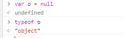

# Null 类型

## ★吾有一值与你undefined类型一样

> Null 类型是第二个只有一个值的数据类型，这个特殊的值是 null 。

undefined类型你不是派生于我Null类型的吗？所以我同样是也是一个值哦！

## ★为啥typeof null会返回个object？

> 从逻辑角度来看， null 值表示一个空对象指针，而这也正是使用 typeof 操作符检测 null 值时会返回 "object" 的原因。

老实说，这个解释有点牵强哈！不管这样，看代码，**✎：**



## ★最佳实践

> 如果定义的变量准备在将来用于保存对象，那么最好将该变量初始化为 null 而不是其他值。这样一来，只要直接检查 null 值就可以知道相应的变量是否已经保存了一个对象的引用。

就像是这样，**✎：**

```js
if (car != null){
	// 对 car 对象执行某些操作
}
```


## ★想不到null == undefined？

> 实际上， undefined 值是派生自 null 值的，因此 ECMA-262规定对它们的相等性测试要返回 true

```js
alert(null == undefined); //true
```

如果它们都表示「无」值，我倒是可以接收的，可是你说undefined继承自null，所以就要返回true，我就接受不了。


言归正传，**✎：**

> 这里，位于 null 和 undefined 之间的相等操作符（ == ）总是返回 true ，不过要注意的是，这个操作符出于比较的目的会转换其操作数（本章后面将详细介绍相关内容）。

也就是所谓的隐式转换吧！

## ★要去做的

> 尽管 null 和 undefined 有这样的关系，但它们的用途完全不同。如前所述，无论在什么情况下
> 都没有必要把一个变量的值显式地设置为 undefined ，可是同样的规则对 null 却不适用。换句话说，
> 只要意在保存对象的变量还没有真正保存对象，就应该明确地让该变量保存 null 值。这样做不仅可以
> 体现 null 作为空对象指针的惯例，而且也有助于进一步区分 null 和 undefined 。

在这儿，这样的关系指的是它们俩的 `==`操作返回一个true值！

总之不需要显示地设置为undefined，而null则需要了，用以明确这个变量就是存储对象的，有时候我在想，你要是个强类型语言的话，那么这个理由也就不存在了，毕竟这个变量存储什么类型的就早早规定好了，就不用在运行时确定的了！也不用去想着遵循什么惯例了！

## ★小结

- 你可以不给一个变量的初始值为undefined，但是如果你想这个变量是保存对象的，而此刻找不着没有合适的对象的话，那么就给个null吧！

## ★ Q&A

### ①undefined 值是派生自 null 值？

**➹：**[undefined与null的区别 - 阮一峰的网络日志](http://www.ruanyifeng.com/blog/2014/03/undefined-vs-null.html)

**➹：**[javascript - js高级程序设计书中说，undefined值是派生自null值。这句话怎么理解？ - SegmentFault 思否](https://segmentfault.com/q/1010000008938781)

有这么一种现象，**✎：**

> 大多数计算机语言，有且仅有一个表示"无"的值，比如，C语言的NULL，Java语言的null，Python语言的None，Ruby语言的nil。
>
> 有点奇怪的是，JavaScript语言居然有**两个**表示"无"的值：undefined和null。

### ②null 和 {} 所占内存？

null到底有没有分配内存？

> `null`的另一个可行的用例，也被认为是良好的实践是一个显式指定变量为无效(`object= null`)当一个引用不再是必需的。通过分配`null`值，有效地清除引用，并假设对象没有引用其他代码，指定垃圾收集，确保回收内存。

也分配了内存哈！

对了关于区分null和undefined这两个值，**✎：**

> 区分这两个值，你可以认为`undefined`代表一个意想不到的没有值，而`null`作为预期没有值的代表。

一个是预料之中，一个是预料之外……前者我命由我不由天，后者听天由命！

**➹：**[Does null occupy memory in javascript? - Stack Overflow](https://stackoverflow.com/questions/6499352/does-null-occupy-memory-in-javascript)

**➹：** [内存管理 - JavaScript —— MDN](https://developer.mozilla.org/zh-CN/docs/Web/JavaScript/Memory_Management)

**➹：**[JavaScript 内存泄漏教程 - 阮一峰的网络日志](http://www.ruanyifeng.com/blog/2017/04/memory-leak.html)

**➹：**[探索JavaScript中Null和Undefined的深渊](https://yanhaijing.com/javascript/2014/01/05/exploring-the-abyss-of-null-and-undefined-in-javascript/)

