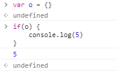

# 3.4.4  Boolean 类型

## ★使用最多的类型

> Boolean 类型是 ECMAScript 中使用得最多的一种类型，该类型只有两个字面值： true 和 false 

## ★其值与数字值的关系

> 这两个值与数字值不是一回事，因此 true 不一定等于 1，而 false 也不一定等于 0

## ★使用

> 以下是为变量赋Boolean 类型值的例子：

```js
var found = true;
var lost = false;
```

> 需要注意的是， Boolean 类型的字面值 true 和 false 是区分大小写的。也就是说， True 和 False（以及其他的混合大小写形式）都不是 Boolean 值，只是标识符。

也及就说布尔类型的字面量true和false就是长这个样子咯！即就是关键字吧！

## ★等价的值

> 虽然 Boolean 类型的字面值只有两个，但 ECMAScript 中**所有类型的值**都有与这两个 Boolean 值等价的值。

也就是那几个falsy值了，**✎：**

- 0、NaN、''、undefined、null、false

**➹：**[JavaScript: Truthy? Falsy? -- 格物致知](https://amobiz.github.io/2015/09/28/javascript-truthy-falsy/)

## ★字符串你想成为我的一份子吗？

> 要将一个值转换为其对应的 Boolean 值，可以调用转型函数 Boolean()，**✎：**

```js
var message = "Hello world!";
var messageAsBoolean = Boolean(message);
```

> 在这个例子中，字符串 message 被转换成了一个 Boolean 值，该值被保存在 messageAsBoolean变量中。

如榨汁机一样，扔进去，然后结果要么是果汁、要么是果肉……

注意，**✎：**

> 可以对**任何数据类型的值**调用 Boolean() 函数，而且总会返回一个 Boolean 值。至于返回的这个值是 true 还是 false ，取决于**要转换值的数据类型及其实际值**。

下表给出了各种数据类型及其对应的转换规则，**✎：**

| 数据类型  | 转换为true的值               | 转换为false的值                       |
| --------- | ---------------------------- | ------------------------------------- |
| Boolean   | true                         | false                                 |
| String    | 任何非空字符串               | "" （空字符串）                       |
| Number    | 任何非零数字值（包括无穷大） | 0和 NaN （参见本章后面有关NaN的内容） |
| Object    | 任何对象                     | null                                  |
| Undefined | n/a^①^                       | undefined                             |

ps：① n/a（或 N/A），是 not applicable的缩写，意思是“不适用”。

我开始对null为什么`typeof null`返回一个object有点感觉了！

话说回来，这些转换规则有啥用？

> 这些转换规则对理解**流控制语句（如 if 语句）自动执行相应的 Boolean 转换**非常重要，**✎：**

```js
var message = "Hello world!";
if (message){
	alert("Value is true");
}
```

> 运行这个示例，就会显示一个警告框，因为字符串 message 被自动转换成了对应的 Boolean 值（ true ）。

所以，**✎：**

> 由于存在这种**自动执行的 Boolean 转换**，因此确切地知道在流控制语句中**使用的是什么变量**至关重要。错误地使用一个对象而不是一个 Boolean 值，就有可能彻底改变应用程序的流程。

如果这个变量是个实打实的对象，不是所谓的null的话，在在条件判断语句中，用这个变量作为判断条件，显然没有任何意义！

所以如果你想使用流控制语句的话，首先你就得知道这个判断条件将会使用的是什么变量！而不是这样，**✎：**



## ★小结

- Boolean类型只有两个值——true和false，注意区分大小写
- 布尔值和数字值是两回事，不要认为true就是1，false就是0，虽然可以通过转型函数Boolean() 可以做到，但这依旧是两码事！
- 任何数据类型的值，要想转换成布尔类型的值，都免不了要遵守一个规则，即Falsy和Truthy。总之有6个falsy值！
- 在使用流控制语句的过程中，一定要确切知道这个判断条件出现的变量，其类型以及其可能出现的值，唯有这样，你才会知道程序的流向为几何……


