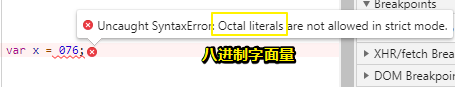
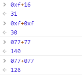
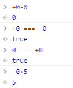
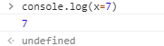

# 3.4.5  Number 类型

## ★最令人关注的

> Number 类型应该是 ECMAScript 中**最令人关注的**数据类型了，这种类型使用 **IEEE754 格式**来表示**整数**和**浮点数值**（浮点数值在某些语言中也被称为**双精度数值**）。

## ★有各种的数值类型

> 为支持各种数值类型，ECMA-262 定义了不同的**数值字面量格式**。

### ◇十进制整数

> **最基本的**数值字面量格式是十进制整数，十进制整数可以像下面这样直接在代码中输入，**✎：**

```js
var intNum = 55; // 整数
```

### ◇其它进制的整数

> 整数还可以通过八进制（以 8 为基数）或十六进制（以 16 为基数）的字面值来表示

#### 八进制长啥样

1. 字面值第一位必须是0
2. 都是以8进制数字数列（0~7）组成

如果不满足第2条，即超出字面值中的数值超出了范围，**✎：**

那么**前导零将被忽略，后面的数值将被当作十进制数值解析**

举个例子，**✎：**

```js
var octalNum1 = 070; // 八进制的 56
var octalNum2 = 079; // 无效的八进制数值——解析为 79
var octalNum3 = 08; // 无效的八进制数值——解析为 8
```

 octal：八进制的

显然你不会那么无聊写出有8、9这样的数值字面量

注意，**✎：**

> 八进制字面量在严格模式下是无效的，会导致支持的 JavaScript 引擎抛出错误。



#### 那十六进制呢？

1. 前两位必须是0x
2. 后跟任何十六进制数字（0～9 及 A～F）

ps：字母 A～F可以大写，也可以小写

如，**✎：**

```js
var hexNum1 = 0xA; // 十六进制的 10
var hexNum2 = 0x1f; // 十六进制的 31
```

#### 进行算术计算？不同的字面量？

> 在进行算术计算时，所有以八进制和十六进制表示的数值最终都将被转换成十进制数值

也就是说，你一个十六进制的数加上十进制的数，最终的结果是十进制的数咯！



不管你是同类相加，还是异类相加，最终的结果都是一种字面量，即十进制数！

### ◇敲黑板

> 鉴于 JavaScript 中保存数值的方式，可以保存正零（+0）和负零（-0）。正零和负零被认为相等，但为了读者更好地理解上下文，这里特别做此说明。



随便吧！反正我从来不会写-0……

## ★小结

## ★Q&A

### ①IEEE754格式什么鬼？

**➹：**[IEEE 754 - 维基百科，自由的百科全书](https://zh.wikipedia.org/wiki/IEEE_754)

**➹：**[IEEE 754格式是什么? - 知乎](https://www.zhihu.com/question/21711083)

我先不要在乎细节，因为我知道我很容易会遗忘！摘录其中一个答案，**✎：**

**➹：**[IEEE 754格式是什么? - 陈肖恩的回答 - 知乎](https://www.zhihu.com/question/21711083/answer/23620936)

> 就是由**电气电子工程师学会（IEEE）**定义的浮点数在内存中的算法规范。

它是个算法规范啊！

还有就是这个规范出现的原因，**✎：**

> 在六、七十年代，各家计算机公司的各个型号的计算机，有着千差万别的浮点数表示，却没有一个业界通用的标准。这给数据交换、计算机协同工作造成了极大不便。IEEE的浮点数专业小组于七十年代末期开始酝酿浮点数的标准。

话说回来，为什么会有小数呢？

- 有人说小数很直观，在做两个数值比较的时候

那么小数的概念呢？**✎：**

> **小数**，是[实数](https://zh.wikipedia.org/wiki/%E5%AE%9E%E6%95%B0)的一种特殊的表现形式。所有[分数](https://zh.wikipedia.org/wiki/%E5%88%86%E6%95%B0)都可以表示成小数，小数中的圆点叫做[小数点](https://zh.wikipedia.org/wiki/%E5%B0%8F%E6%95%B0%E7%82%B9)，它是一个小数的[整数](https://zh.wikipedia.org/wiki/%E6%95%B4%E6%95%B0)部分和小数部分的分界号。其中整数部分是[零](https://zh.wikipedia.org/wiki/0)的小数叫做纯小数，整数部分不是零的小数叫做带小数。


ps：无限不循环小数也就是[无理数](https://zh.wikipedia.org/wiki/%E6%97%A0%E7%90%86%E6%95%B0)，不能化成分数形式。如π……

**➹：**[有了分数，为什么还要有小数？ - 知乎](https://www.zhihu.com/question/56895940)

**➹：**[在现实生活中的无理数是怎样存在的？ - 知乎](https://www.zhihu.com/question/26902412)

**➹：**[圆周率π的计算历程 - 算法与数学之美 ——十条](http://www.10tiao.com/html/600/201609/2652550185/1.html)

**➹：**[小数 - 维基百科，自由的百科全书](https://zh.wikipedia.org/wiki/%E5%B0%8F%E6%95%B0)

我觉得我应该去看一下「数学之美」这本书才行了！

### ②关于字面量？

**➹：**[如何理解Javascript中的字面量(literal)？ - 知乎](https://www.zhihu.com/question/21502764)

通过其与值（value）的区别来理解它，**✎：**

> value代表这个值。
> literals代表如何表达这个值。

总之，**✎：**

> 因为所有的程序都是字符序列。所以literal定义就可以是，在所处上下文中，表达某个特定的值的字符序列。

ps：关于其与表达式的区别，**✎：**

> 一般来说表达式不认为是字面量，字面量指那种直接代表某个常数值的一种表达形式。

还是举个例子吧！

15是个value，也可以说是个literal，当然不止这一种literal，还有诸如十五、0xF等……

突然感到这个字面量似乎是等价于值的，当我看了这句话，我就不这样认为了，**✎：**

> 一个值可以用多种literal表达，值也可以是表达式的结果：如1+2的值就是3。

也就说值也可以是字面量的结果咯！只是表达一个值的姿势是多样的，有种同义词的味道！而表达式则是多了操作符！

一个与其它语言语法的比较，**✎：**

> JavaScript的Literal Syntax可以不使用“定义结构，然后new”的方式产生对象/函数。

```js
var array = [1, 2, 3];
var map = {x: 1, y: 2};
var fn = function() { return ""; }
```

```java
int[] array = new int[] {1, 2, 3};
Map map = new HashMap();
map.put(x, 1);
map.put(y, 2);
Object obj = new Object() {
  public String toString() {
    return "";
  }
};
```

### ③表达式

**➹：**[表达式和运算符 - JavaScript - MDN](https://developer.mozilla.org/zh-CN/docs/Web/JavaScript/Guide/Expressions_and_Operators#%E8%A1%A8%E8%BE%BE%E5%BC%8F)

> 每一个合法的表达式都能计算成某个值，但从概念上讲，有两种类型的表达式：有副作用的（比如赋值）和单纯计算求值的。

我之前的理解就是操作符+操作数，返回有值的式子……

有副作用的：`x=7`



单纯计算求值的：`3+4`

你不知道JavaScript的表达式原来还有类型之分的，**✎：**

> - 算数: 得出一个数字, 例如 3.14159. (通常使用 [arithmetic operators](https://developer.mozilla.org/zh-CN/docs/Web/JavaScript/Guide/Expressions_and_Operators#Arithmetic_operators).)
> - 字符串: 得出一个字符串, 例如, "Fred" 或 "234". (通常使用 [string operators](https://developer.mozilla.org/zh-CN/docs/Web/JavaScript/Guide/Expressions_and_Operators#String_operators).)
> - 逻辑值: 得出true或者false. (经常涉及到 [logical operators](https://developer.mozilla.org/zh-CN/docs/Web/JavaScript/Guide/Expressions_and_Operators#Logical_operators).)
> - 基本表达式: javascript中基本的关键字和一般表达式。如this
> - 左值表达式: 分配给左值。


