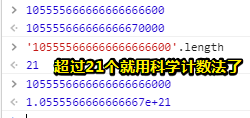

# 3.4.5  Number 类型

## ★最令人关注的

> Number 类型应该是 ECMAScript 中**最令人关注的**数据类型了，这种类型使用 **IEEE754 格式**来表示**整数**和**浮点数值**（浮点数值在某些语言中也被称为**双精度数值**）。

## ★有各种的数值类型

> 为支持各种数值类型，ECMA-262 定义了不同的**数值字面量格式**。

### ◇十进制整数

> **最基本的**数值字面量格式是十进制整数，十进制整数可以像下面这样直接在代码中输入，**✎：**

```js
var intNum = 55; // 整数
```

### ◇其它进制的整数

> 整数还可以通过八进制（以 8 为基数）或十六进制（以 16 为基数）的字面值来表示

#### 八进制长啥样

1. 字面值第一位必须是0
2. 都是以8进制数字数列（0~7）组成

如果不满足第2条，即超出字面值中的数值超出了范围，**✎：**

那么**前导零将被忽略，后面的数值将被当作十进制数值解析**

举个例子，**✎：**

```js
var octalNum1 = 070; // 八进制的 56
var octalNum2 = 079; // 无效的八进制数值——解析为 79
var octalNum3 = 08; // 无效的八进制数值——解析为 8
```

 octal：八进制的

显然你不会那么无聊写出有8、9这样的数值字面量

注意，**✎：**

> 八进制字面量在严格模式下是无效的，会导致支持的 JavaScript 引擎抛出错误。


#### 那十六进制呢？

1. 前两位必须是0x
2. 后跟任何十六进制数字（0～9 及 A～F）

ps：字母 A～F可以大写，也可以小写

如，**✎：**

```js
var hexNum1 = 0xA; // 十六进制的 10
var hexNum2 = 0x1f; // 十六进制的 31
```

这个在严格模式下可不会无效！

#### 进行算术计算？不同的字面量？

> 在进行算术计算时，所有以八进制和十六进制表示的数值最终都将被转换成十进制数值

也就是说，你一个十六进制的数加上十进制的数，最终的结果是十进制的数咯！


不管你是同类相加，还是异类相加，最终的结果都是一种字面量，即十进制数！

### ◇敲黑板

> 鉴于 JavaScript 中保存数值的方式，可以保存正零（+0）和负零（-0）。正零和负零被认为相等，但为了读者更好地理解上下文，这里特别做此说明。


随便吧！反正我从来不会写-0……

## ★浮点数值

### ◇概念

我想写个浮点数值，那么，**✎：**

1. 该数值中必须包含一个小数点
2. 小数点后面必须至少有一位数字

好了，满足这2个点就是一个浮点数值了！

还有一点需要留意的就是，有些人总喜欢装逼，**✎：**

> 小数点前面可以没有整数

不过，不推荐这种写法……

举几个例子，**✎：**

```js
var floatNum1 = 1.1;
var floatNum2 = 0.1;
var floatNum3 = .1; // 有效，但不推荐
```

### ◇内存空间

> 由于保存浮点数值需要的内存空间是保存整数值的两倍，因此 ECMAScript会**不失时机地**将浮点数值转换为整数值。

举个例子，**✎：**

```js
var floatNum1 = 1.; // 小数点后面没有数字——解析为 1
var floatNum2 = 10.0; // 整数——解析为 10
```


1. 如果小数点后面没有跟任何数字，那么这个数值就可以作为整数值来保存。
2. 如果浮点数值**本身表示的就是一个整数**（如 1.0），那么该值也会被转换为整数。

### ◇科学计数法

#### 何时用它表示？

> 对于那些极大或极小的数值，可以用 **e 表示法**（即科学计数法）表示的浮点数值表示。

#### 关于e？

> 用 e 表示法表示的数值等于 e 前面的数值乘以 10 的指数次幂。

#### ECMAScript中e表示法的姿势？

> ECMAScript 中 e 表示法的格式也是如上述的一样，即前面一个数值（可以是**整数**也可以是**浮点数**），中间是一个**大写或小写**的**字母 E**，后面是 10 的幂运算中的指数，该幂值（幂运算的结果）将用来与前面的数相乘。

举个例子，**✎：**

```js
var floatNum = 3.125e7; // 等于 31250000
```

这就是一个使用 e 表示法表示数值的例子！


> 在这个例子中，使用 e 表示法表示的变量 floatNum 的形式虽然简洁，但它的**实际值**则是 31250000。
> 在此，e 表示法的**实际含义**就是“3.125 乘以 10 ^7^ ”。

注意，**✎：**



那么极小的值呢？

> 也可以使用 e 表示法表示极小的数值，如 0.00000000000000003，这个数值可以使用更简洁的 3e-17
> 表示。在默认情况下，ECMASctipt 会将那些小数点后面带有 6 个零以上的浮点数值转换为以 e 表示法
> 表示的数值（例如，0.0000003 会被转换成 3e-7）。


注意如果前面除了0还有其它数字的话，那么就不会科学记数法表示了！


### ◇精度

> 浮点数值的最高精度是 17 位小数，但在进行算术计算时其精确度远远不如整数。

```js
1/7 //0.14285714285714285
```

刚好小数点后17位！

有这么一个例子，**✎：**

```js
0.1+0.3 //0.30000000000000004
```

你会发现0.1 加 0.2的结果不是 0.3，而是 0.30000000000000004。

注意，**✎：**

> 这个小小的舍入误差会导致无法测试特定的浮点数值。

关于舍入误差指运算得到的[近似值](https://www.wikiwand.com/zh-hans/%E8%BF%91%E4%BC%BC%E5%80%BC)和精确值之间的差异。

我之前有了解过，二进制在表示小数的时候，有些小数是无法用二进制精确表示的！如0.1。

关于「在进行算术计算时浮点数值精确度远远不如整数」，因为存在舍入误差，而整数就没有了，即精度无缺失！

例如，**✎：**

```js
if (a + b == 0.3){ // 不要做这样的测试！
	alert("You got 0.3.");
}
```

> 在这个例子中，我们测试的是两个数的和是不是等于 0.3。如果这两个数是 0.05 和 0.25，或者是 0.15
> 和 0.15 都不会有问题。而如前所述，如果这两个数是 0.1 和 0.2，那么测试将无法通过。因此，永远不
> 要测试某个特定的浮点数值。


### ◇敲黑板

> 关于浮点数值计算会产生舍入误差的问题，有一点需要明确：这是使用**基于IEEE754 数值的浮点计算的通病**，ECMAScript 并非独此一家；其它使用相同数值格式的语言也存在这个问题。

**➹：**[0.30000000000000004.com](http://0.30000000000000004.com/)

## ★数值范围

### ◇有个非常非常大的数

> 由于内存的限制，ECMAScript 并不能保存世界上所有的数值。

### ◇最小数值和最大数值

- ECMAScript 能够表示的最小数值保存在 **Number.MIN_VALU**E 中——在大多数浏览器中，这个值是 5e-324
- 能够表示的最大数值保存在**Number.MAX_VALUE** 中——在大多数浏览器中，这个值是 1.7976931348623157e+308


### ◇Infinite

#### 如何得到这个值

- 如果某次计算的结果得到了一个**超出 JavaScript 数值范围的值**，那么这个数值将被**自动转换**成特殊的 Infinity 值。
- 具体来说，如果这个数值是负数，则会被转换成 -Infinity （负无穷），如果这个数值是正数，则会被转
  换成 Infinity （正无穷）。

#### 这个值不能干什么

> 如果某次计算返回了正或负的 Infinity 值，那么该值将**无法继续参与下一次的计算**，因为 Infinity 不是能够参与计算的数值。

#### 如何确定一个值是否无穷？

> 要想确定一个数值是不是有穷的（换句话说，是不是位于最小和最大的数值之间），可以使用 isFinite() 函数。

这个函数在参数位于最小与最大数值之间时会返回 true。**✎：**

```js
var result = Number.MAX_VALUE + Number.MAX_VALUE;
alert(isFinite(result)); //false
```

我很好奇，为啥最大值加个1，这个函数的结果还是true，**✎：**


#### 需要检测监控这些值吗？

> 尽管在计算中很少出现某些值超出表示范围的情况，但**在执行极小或极大数值的计算**时，检测监控这些值是可能的，也是必需的。

#### 敲黑板

> 访问 Number.NEGATIVE_INFINITY 和 Number.POSITIVE_INFINITY 也可以得到负和正 Infinity 的值。可以想见，这两个属性中分别保存着 -Infinity 和Infinity 。

## ★NaN

### ◇是什么？

> NaN ，即非数值（Not a Number）是一个**特殊的数值**，这个数值用于表示一个**本来要返回数值的操作数**未返回数值的情况（这样就**不会抛出错误了**）。

关于不会抛出错误的理解，**✎：**

> 在其他编程语言中，任何数值除以 0都会导致错误，从而**停止代码执行**。但在 ECMAScript中，任何数值除以 0会返回 NaN^①^ ，因此不会影响其他代码的执行。

也就是说代码本来执行得好好的，突然一个5/0，导致程序终止了！而JavaScript则是自带修复机制，把此计算的结果转化为其它值！


ps：① 原书如此，但实际上只有 0除以 0 才会返回 NaN，正数除以 0 返回 Infinity，负数除以 0返回-Infinity。

### ◇两个奇葩的特点

> NaN 本身有两个非同寻常的特点。

1. 任何涉及 NaN 的操作（例如 NaN /10）都会返回 NaN，这个特点在**多步计算**中有可能导致问题
2. NaN 与任何值都不相等，包括 NaN 本身

第二点怎么说呢？**✎：**


### ◇isNaN()函数的由来

> 针对 NaN 的这两个特点，ECMAScript 定义了 isNaN() 函数

功能，**✎：**

> 这个函数接受一个参数，该参数可以是**任何类型**，而函数会帮我们**确定这个参数是否“不是数值”**

在读这个函数时，应该在——是（不是）、「不是数值」，这二者停顿一下，还有一点就是一般返回一个布尔值的函数，其命名开头都会有个**is**，如`isXxx`……

原理，**✎：**

>  isNaN() 在接收到一个值之后，会尝试**将这个值转换为数值**。某些不是数值的值会直接转换为数值，例如字符串 "10" 或 Boolean 值。而**任何不能被转换为数值的值**都会导致这个函数返回 **true** 。

例如，**✎：**

```js
alert(isNaN(NaN)); //true
alert(isNaN(10)); //false（10 是一个数值）
alert(isNaN("10")); //false（可以被转换成数值 10）
alert(isNaN("blue")); //true（不能转换成数值）
alert(isNaN(true)); //false（可以被转换成数值 1）
```

解释，**✎：**

> 这个例子测试了 5 个不同的值。测试的第一个值是 NaN 本身，结果当然会返回 true 。
>
> 然后分别测试了数值 10 和字符串 "10" ，结果这两个测试都返回了 false ，因为前者本身就是数值，而后者可以被转换成数值。
>
> 但是，字符串 "blue" 不能被转换成数值，因此函数返回了 true 。由于 Boolean 值 true可以转换成数值 1，因此函数返回 false 。

关于NaN真是奇怪啊！**✎：**


你TM是个number类型却不是个数值！

### ◇敲黑板

> 尽管有点儿不可思议，但 isNaN() 确实也适用于对象。在基于对象调用 isNaN()函数时，会首先调用对象的 valueOf() 方法，然后确定该方法返回的值是否可以转换为数值。
>
> 如果不能，则基于这个返回值再调用 toString() 方法，再测试返回值。
>
> 而这个过程也是 ECMAScript中内置函数和操作符的一般执行流程，更详细的内容请参见 3.5 节。

**➹：**[Object.prototype.valueOf() - JavaScript - MDN](https://developer.mozilla.org/zh-CN/docs/Web/JavaScript/Reference/Global_Objects/Object/valueOf)

## ★数值转换

### ◇听说有3个函数？

> 有 3 个函数可以把非数值转换为数值： Number() 、 parseInt() 和 parseFloat() 。

解释一波，**✎：**

> 第一个函数，即转型函数 Number() 可以用于任何数据类型，而另两个函数则专门用于把字符串转换成数值。而且这 3个函数对于**同样的输入**会有**返回不同的结果**。

1个万金油，2个字符串……


### ◇Number()

#### 转换规则

-  如果是 Boolean 值， true 和 false 将分别被转换为 1 和 0
-  如果是数字值，只是简单的传入和返回
-  如果是 null 值，返回 0。
-  如果是 undefined ，返回 NaN 。
-  如果是字符串，遵循下列规则：
  - 如果字符串中只包含数字（包括前面带正号或负号的情况），则将其转换为十进制数值，即 "1"
    会变成 1， "123" 会变成 123，而 "011" 会变成 11（注意：前导的零被忽略了）
  -  如果字符串中包含有效的浮点格式，如 "1.1" ，则将其转换为对应的浮点数值（同样，也会忽
    略前导零）；
  - 如果字符串中包含有效的十六进制格式，例如 "0xf" ，则将其转换为相同大小的十进制整
    数值；
  - 如果字符串是空的（不包含任何字符），则将其转换为 0；
  - 如果字符串中包含除上述格式之外的字符，则将其转换为 NaN 
-  如果是对象，则调用对象的 valueOf() 方法，然后依照前面的规则转换返回的值。如果转换的结果是 NaN ，则调用对象的 toString() 方法，然后再次依照前面的规则转换返回的字符串值。

> 根据这么多的规则使用 Number() 把各种数据类型转换为数值确实有点复杂。

为此，**✎：**

> 下面还是给出几个具体的例子吧！

```js
var num1 = Number("Hello world!"); //NaN
var num2 = Number(""); //0
var num3 = Number("000011"); //11
var num4 = Number(true); //1
```

我写了个函数用于测试这个Number()，**✎：**

```js
function toNumber(){
	let arr = []
	for(let i = 0;i < arguments.length;i++){
		console.log(Number(arguments[i]))
		arr.push(Number(arguments[i]))
	}
	return arr
}
```


ps：


我很好奇为啥NaN是Undefined类型的！


看了这个，感觉有毒哈！

我明白了，这个toString并不是一个全局函数啊！傻吊！


总之Number函数要么是正常的数值，要么是NaN！


## ★小结

- 需要去看的文章：
  - **➹：**[JavaScript 浮点数陷阱及解法 · Issue #9 · camsong/blog](https://github.com/camsong/blog/issues/9)
- Number类型的内容是真得多，真是奇妙的数值！所谓的「计算」就是如此吧！当然，在计算机内部都是0和1！

## ★Q&A

### ①IEEE754格式什么鬼？

**➹：**[IEEE 754 - 维基百科，自由的百科全书](https://zh.wikipedia.org/wiki/IEEE_754)

**➹：**[IEEE 754格式是什么? - 知乎](https://www.zhihu.com/question/21711083)

我先不要在乎细节，因为我知道我很容易会遗忘！摘录其中一个答案，**✎：**

**➹：**[IEEE 754格式是什么? - 陈肖恩的回答 - 知乎](https://www.zhihu.com/question/21711083/answer/23620936)

> 就是由**电气电子工程师学会（IEEE）**定义的浮点数在内存中的算法规范。

它是个算法规范啊！

还有就是这个规范出现的原因，**✎：**

> 在六、七十年代，各家计算机公司的各个型号的计算机，有着千差万别的浮点数表示，却没有一个业界通用的标准。这给数据交换、计算机协同工作造成了极大不便。IEEE的浮点数专业小组于七十年代末期开始酝酿浮点数的标准。

话说回来，为什么会有小数呢？

- 有人说小数很直观，在做两个数值比较的时候

那么小数的概念呢？**✎：**

> **小数**，是[实数](https://zh.wikipedia.org/wiki/%E5%AE%9E%E6%95%B0)的一种特殊的表现形式。所有[分数](https://zh.wikipedia.org/wiki/%E5%88%86%E6%95%B0)都可以表示成小数，小数中的圆点叫做[小数点](https://zh.wikipedia.org/wiki/%E5%B0%8F%E6%95%B0%E7%82%B9)，它是一个小数的[整数](https://zh.wikipedia.org/wiki/%E6%95%B4%E6%95%B0)部分和小数部分的分界号。其中整数部分是[零](https://zh.wikipedia.org/wiki/0)的小数叫做纯小数，整数部分不是零的小数叫做带小数。


ps：无限不循环小数也就是[无理数](https://zh.wikipedia.org/wiki/%E6%97%A0%E7%90%86%E6%95%B0)，不能化成分数形式。如π……

**➹：**[有了分数，为什么还要有小数？ - 知乎](https://www.zhihu.com/question/56895940)

**➹：**[在现实生活中的无理数是怎样存在的？ - 知乎](https://www.zhihu.com/question/26902412)

**➹：**[圆周率π的计算历程 - 算法与数学之美 ——十条](http://www.10tiao.com/html/600/201609/2652550185/1.html)

**➹：**[小数 - 维基百科，自由的百科全书](https://zh.wikipedia.org/wiki/%E5%B0%8F%E6%95%B0)

我觉得我应该去看一下「数学之美」这本书才行了！

### ②关于字面量？

**➹：**[如何理解Javascript中的字面量(literal)？ - 知乎](https://www.zhihu.com/question/21502764)

通过其与值（value）的区别来理解它，**✎：**

> value代表这个值。
> literals代表如何表达这个值。

总之，**✎：**

> 因为所有的程序都是字符序列。所以literal定义就可以是，在所处上下文中，表达某个特定的值的字符序列。

ps：关于其与表达式的区别，**✎：**

> 一般来说表达式不认为是字面量，字面量指那种直接代表某个常数值的一种表达形式。

还是举个例子吧！

15是个value，也可以说是个literal，当然不止这一种literal，还有诸如十五、0xF等……

突然感到这个字面量似乎是等价于值的，当我看了这句话，我就不这样认为了，**✎：**

> 一个值可以用多种literal表达，值也可以是表达式的结果：如1+2的值就是3。

也就说值也可以是字面量的结果咯！只是表达一个值的姿势是多样的，有种同义词的味道！而表达式则是多了操作符！

一个与其它语言语法的比较，**✎：**

> JavaScript的Literal Syntax可以不使用“定义结构，然后new”的方式产生对象/函数。

```js
var array = [1, 2, 3];
var map = {x: 1, y: 2};
var fn = function() { return ""; }
```

```java
int[] array = new int[] {1, 2, 3};
Map map = new HashMap();
map.put(x, 1);
map.put(y, 2);
Object obj = new Object() {
  public String toString() {
    return "";
  }
};
```

### ③表达式

**➹：**[表达式和运算符 - JavaScript - MDN](https://developer.mozilla.org/zh-CN/docs/Web/JavaScript/Guide/Expressions_and_Operators#%E8%A1%A8%E8%BE%BE%E5%BC%8F)

> 每一个合法的表达式都能计算成某个值，但从概念上讲，有两种类型的表达式：有副作用的（比如赋值）和单纯计算求值的。

我之前的理解就是操作符+操作数，返回有值的式子……

有副作用的：`x=7`


单纯计算求值的：`3+4`

你不知道JavaScript的表达式原来还有类型之分的，**✎：**

> - 算数: 得出一个数字, 例如 3.14159. (通常使用 [arithmetic operators](https://developer.mozilla.org/zh-CN/docs/Web/JavaScript/Guide/Expressions_and_Operators#Arithmetic_operators).)
> - 字符串: 得出一个字符串, 例如, "Fred" 或 "234". (通常使用 [string operators](https://developer.mozilla.org/zh-CN/docs/Web/JavaScript/Guide/Expressions_and_Operators#String_operators).)
> - 逻辑值: 得出true或者false. (经常涉及到 [logical operators](https://developer.mozilla.org/zh-CN/docs/Web/JavaScript/Guide/Expressions_and_Operators#Logical_operators).)
> - 基本表达式: javascript中基本的关键字和一般表达式。如this
> - 左值表达式: 分配给左值。

### ④不失时机？

> 不失时机是一个汉语成语，拼音是bù shī shí jī，意思是指办事要抓住适宜的时间和有利的机会。

也就是天时地利人和咯！

### ⑤幂？

**➹：**[幂 - Wikiwand](https://www.wikiwand.com/zh-hans/%E5%86%AA)

> **幂运算**（英语：Exponentiation），又称**指数运算**，是[数学](https://www.wikiwand.com/zh-hans/%E6%95%B8%E5%AD%B8)[运算](https://www.wikiwand.com/zh-hans/%E9%81%8B%E7%AE%97)，[表达式](https://www.wikiwand.com/zh-hans/%E8%A1%A8%E8%BE%BE%E5%BC%8F)为 **b^n^**。其中，*b* 称为[底数](https://www.wikiwand.com/zh-hans/%E5%BA%95%E6%95%B0)，而 *n* 称为[指数](https://www.wikiwand.com/zh-hans/%E6%8C%87%E6%95%B0)，其[结果](https://www.wikiwand.com/zh-hans/%E7%BB%93%E6%9E%9C)为 *b* 自乘 *n* 次。

### ⑥舍入误差？

**➹：**[舍入误差 - Wikiwand](https://www.wikiwand.com/zh-hans/%E6%8D%A8%E5%85%A5%E8%AA%A4%E5%B7%AE)

> **舍入误差**（英语：**round-off error**)，是指运算得到的[近似值](https://www.wikiwand.com/zh-hans/%E8%BF%91%E4%BC%BC%E5%80%BC)和精确值之间的差异。比如当用有限位数的[浮点数](https://www.wikiwand.com/zh-hans/%E6%B5%AE%E7%82%B9%E6%95%B0)来表示[实数](https://www.wikiwand.com/zh-hans/%E5%AE%9E%E6%95%B0)的时候(理论上存在无限位数的浮点数)就会产生舍入误差。


### ⑦0.1+0.2？

我没有去细看为什么，我就知道这该如何去解决了，拿来主义，使用库，**✎：**

**➹：**[math.js](https://github.com/josdejong/mathjs)

**➹：**[JS魔法堂：彻底理解0.1 + 0.2 === 0.30000000000000004的背后 - ^_^肥仔John - 博客园](https://www.cnblogs.com/fsjohnhuang/p/5115672.html)

**➹：**[为什么0.1+0.2不等于0.3 - 个人文章 - SegmentFault 思否](https://segmentfault.com/a/1190000012175422)

**➹：**[0.30000000000000004.com](http://0.30000000000000004.com/)

我还是简单总结一下好了，**✎：**

在计算机内部的0.1和0.2是以二进制表示的，而**✎：**

> 众所周知JS仅有Number这个数值类型，而Number采用的时IEEE 754 64位双精度浮点数编码。

又因为0.1和0.2的二进制表示是无限循环的

无限（精确值）和截断的值（近似值），它们之间的差异就是舍入误差！

我在想精度既然已经丢失了，为啥0.1+0.2还会大于0.3呢？

还有就是0.7 * 180==125.99999999998，这个就是小于126的结果了！

总之我大可认为这个小数有舍入误差的情况出现，那么计算的结果并不会如你所想！

所以程序员在使用浮点数进行计算或逻辑处理时，记住，永远**不要直接比较两个浮点的大小**，**✎：**

```js
if (a + b == 0.3){ // 不要做这样的测试！
	alert("You got 0.3.");
}
```

注意，**✎：**

1. 对于 0.1 + 0.3 ，结果其实并不是0.4，但0.4是最接近真实结果的数，比其它任何浮点数都更接近。许多语言也就直接显示结果为0.4了，而不展示一个浮点数的真实结果了。
2. **二进制能精确地表示位数有限且分母能表示成2^n的小数？（持怀疑态度）**，比如0.5（1/2），0.5在计算机内部就没有舍入误差。所以0.5 + 0.5 === 1。
3. 整数是完全精度的，不存在舍入误差。

如何解决舍入误差的bug？让浮点数计算正常点，**✎：**

**➹：**[bignumber.js](https://github.com/MikeMcl/bignumber.js)

bignumber.js会在一定精度内，让浮点数计算结果符合我们的期望

ps：

> **十进制整数转二进制方法：除2取余；十进制小数转二进制方法：乘2除整**

十进制0.1转换成二进制，乘2取整过程：

```js
0.1 * 2 = 0.2 # 0
0.2 * 2 = 0.4 # 0
0.4 * 2 = 0.8 # 0
0.8 * 2 = 1.6 # 1
0.6 * 2 = 1.2 # 1
0.2 * 2 = 0.4 # 0

.....
```

总之，就用库解决这些bug就可以了！

### ⑧isFinite()？

**➹：**[isFinite() - JavaScript - MDN](https://developer.mozilla.org/zh-CN/docs/Web/JavaScript/Reference/Global_Objects/isFinite)

我还是不知道为啥最大值+1不是无穷的值，不是说好了，**✎：**

> 计算的结果得到了一个**超出 JavaScript 数值范围的值**，那么这个数值将被**自动转换**成特殊的 Infinity 值。

有毒啊！对应无穷的值、边界的值，计算起来真得无厘头啊！

**➹：**[JS 的整型你懂了吗？ - elise - SegmentFault 思否](https://segmentfault.com/a/1190000002608050)

### ⑨基于对象的isNaN()？

1. valueOf()
   1. 要么数值转换
   2. 要么toString()，看看能否数值转换

总之，**✎：**

对象转换成数字的逻辑， 步骤 如下：

> 1、如果对象有valueOf方法，则调用该方法，并返回相应的结果；
>
> 2、否则如果对象有toString方法，则调用该方法，并返回相应的结果；
>
> 3、否则抛出异常。

自定义的valueOf()，**✎：**

```js
var obj = {
    valueOf: function(){
        return 1;
    }
};
console.log(obj + 1);  //输出2
```


ps：通常，所有对象toString方法，内置对象都有自己`toString`实现

**➹：**[【javascript基础】toString、valueOf、转换 【译】 - sniper007 - 博客园](http://www.cnblogs.com/sniper007/archive/2012/11/19/2777378.html)

**➹：**[一眼毁三观：JS中令人发指的valueOf方法 - 程序猿小卡 - 博客园](https://www.cnblogs.com/chyingp/archive/2013/02/22/valueOf.html)

### ⑩关于Number()的源码实现？

我没有找到答案！

**➹：**[javascript - js怎么查看一些方法的实现源代码 比如数组的push()方法 - SegmentFault 思否](https://segmentfault.com/q/1010000004331267)

### ⑪[objec Object]？

**➹：**[javascript - what does [object Object] mean? - Stack Overflow](https://stackoverflow.com/questions/4750225/what-does-object-object-mean)

这是对象的默认序列化，然而为啥不只是一个`[object]`，而是`[object Object]`呢？因为在JavaScript中有不同类型的对象！

- *Function objects*:
  `stringify(function (){})` -> `[object Function]`
- *Array objects*:
  `stringify([])` -> `[object Array]`
- *RegExp objects*
  `stringify(/x/)` -> `[object RegExp]`
- *Date objects*
  `stringify(new Date)` -> `[object Date]`
- … [several more](http://es5.github.io/spec.html#x15-toc) …
- and **Object objects**!
  `stringify({})` -> `[object Object]`

这是因为构造函数被称为「Object」（带有大写的“O”），而术语「object」（带有小的“o”）指的是事物的结构性质。

通常，当你在Javascript中谈论“objects”时，你实际上指的是“Object objects”，而不是其他类型。

stringify（字符串化）应该是这样的：

```js
function stringify (x) {
    console.log(Object.prototype.toString.call(x));
}
```

**➹：**https://stackoverflow.com/a/25419538

我想此刻你应该了解对象的toString方法了吧！通过一个stringify去了解！

**➹：**[Object.prototype.toString() - JavaScript - MDN](https://developer.mozilla.org/zh-CN/docs/Web/JavaScript/Reference/Global_Objects/Object/toString)

⑫⑬⑭⑮⑯⑰⑱⑲⑳