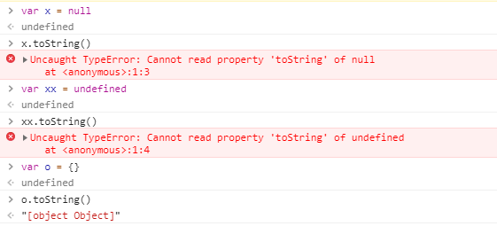
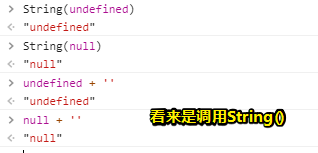

# 3.4.6  String 类型

## ★概念

> String 类型用于表示由零或多个 16 位 Unicode 字符组成的字符序列，即字符串。

## ★基本用法

> 字符串可以由双引号（"）或单引号（'）表示，因此下面两种字符串的写法都是有效的：

```js
var firstName = "Nicholas";
var lastName = 'Zakas';
```

### ◇PHP对单双引号有意见

> 与 PHP 中的双引号和单引号会影响对字符串的解释方式不同，**ECMAScript 中的这两种语法形式没有什么区别**。
>
> 用双引号表示的字符串和用单引号表示的字符串完全相同。

不过，你得注意这个，**✎：**

> 以双引号开头的字符串也必须以双引号结尾，而以单引号开头的字符串必须以单引号结尾。

总之就是有始有终呗！而下面这个例子就显得很不仁义了，**✎：**

```js
var firstName = 'Nicholas"; // 语法错误（左右引号必须匹配）
```

你要知道，这种字符串表示法会导致语法错误……

## ★字符字面量

### ◇定义

> String 数据类型包含一些**特殊的字符字面量**，也叫**转义序列**，用于表示非打印字符，或者具有其他用途的字符。

### ◇有哪些字符字面量呢？

| 字 面 量 | 含 义                                                        |
| -------- | ------------------------------------------------------------ |
| \n       | 换行                                                         |
| \t       | 制表                                                         |
| \b       | 退格                                                         |
| \r       | 回车                                                         |
| \f       | 进纸                                                         |
| `\\`     | 斜杠                                                         |
| \'       | 单引号（ ' ），在用单引号表示的字符串中使用。例如： 'He said, \'hey.\'' |
| \"       | 双引号（ " ），在用双引号表示的字符串中使用。例如： "He said, \"hey.\"" |
| \xnn     | 以十六进制代码 nn 表示的一个字符（其中 n 为0～F）。例如， \x41 表示 "A" |
| \unnnn   | 以十六进制代码 nnnn 表示的一个Unicode字符（其中 n 为0～F）。例如， \u03a3 表示希腊字符Σ |

> 这些字符字面量可以出现在字符串中的任意位置，而且也将被作为一个字符来解析，如下面的例子所示：

```js
var text = "This is the letter sigma: \u03a3.";
```


> 这个例子中的变量 text 有 28 个字符，其中 6 个字符长的转义序列表示 1 个字符。
>
> **任何字符串的长度都可以通过访问其 length 属性取得**，例如：

```js
alert(text.length); // 输出 28
```

> 这个属性返回的字符数包括 16 位字符的数目。如果字符串中包含双字节字符，那么 length 属性可能不会精确地返回字符串中的字符数目。


一般而言，中文都是一个字符占2个字节的，而英文则是一个字符占1个字节，而这里的测试显然没有出现「你好」二字的字符串长度为4的情况！

难道我理解错了吗？

## ★字符串的特点

> ECMAScript 中的字符串是不可变的，也就是说，字符串一旦创建，它们的值就不能改变。

按我所理解就是，这个字符串，如 `'你好'` 在内存中占了坑，那么你不能在这个坑中追加内容了！

> 要改变某个变量保存的字符串，首先要销毁原来的字符串，然后再用另一个包含新值的字符串填充该变量，例如：

```js
var lang = "Java";
lang = lang + "Script";
```

> 以上示例中的变量 lang 开始时包含字符串 "Java" 。而第二行代码把 lang 的值重新定义为 "Java"与 "Script" 的组合，即 "JavaScript" 。

实现这个操作的过程如下：

1. 创建一个能容纳 10 个字符的新字符串
2. 在这个字符串中填充 "Java" 和 "Script"
3. 销毁原来的字符串 "Java" 和字符串 "Script"，因为这两个字符串已经没用了。

> 这个过程是**在后台发生的**，而这也是在某些旧版本的浏览器（例如版本低于 1.0 的 Firefox、IE6 等）中拼接字符串时速度很慢的原因所在。但这些浏览器后来的版本已经解决了这个低效率问题。

也就说，你不需要考虑字符串拼接效率低的问题了！因为最新版的现代浏览器已经解决了此问题！

我在想一个孤零零的字符串，如果没有被赋值到一个变量身上，那么这个字符串就会自动销毁吧！对了，这跟游离的对象是否有区别，我知道游离的对象要想被垃圾回收，并不是立刻就回收的，需要等待一定的时机！

## ★转换为字符串

> 要把一个值转换为一个字符串有两种方式。

### ◇第一种姿势——toString()

> 第一种是使用**几乎每个值**都有的 toString() 方法（第 5 章将讨论这个方法的特点）。这个方法唯一要做的就是**返回相应值的字符串表现**。来看下面的例子：

```js
var age = 11;
var ageAsString = age.toString(); // 字符串"11"
var found = true;
var foundAsString = found.toString(); // 字符串"true"
```

这就像是一个值多了一对引号！



目前，我知道null和undefined这两个值是咩有这个方法的！

> 数值、布尔值、对象和字符串值（没错，每个字符串也都有一个 toString() 方法，该方法返回字符串的一个**副本**）都有 toString() 方法。但 **null 和 undefined 值**没有这个方法。

这里的副本按我的理解就是，又内存中有占了坑咯！不过应该没有那么无聊吧，如 `var x = '666'.toString()`

#### 参数

> 多数情况下，调用 toString() 方法不必传递参数。但是，在调用数值的 toString() 方法时，可以传递一个参数：输出数值的基数。**默认**情况下， toString() 方法以**十进制格式返回数值的字符串**表示。
>
> 而通过传递基数， toString() 可以输出以二进制、八进制、十六进制，乃至其他任意有效进制格式表示的字符串值。下面给出几个例子：

```js
var num = 10;
alert(num.toString()); // "10"
alert(num.toString(2)); // "1010"
alert(num.toString(8)); // "12"
alert(num.toString(10)); // "10"
alert(num.toString(16)); // "a"
```

没想到是可以传递参数的！

> 通过这个例子可以看出，通过指定基数， toString() 方法会改变输出的值。而数值 10 根据基数的不同，可以在输出时被转换为不同的数值格式。
>
> 注意，默认的（没有参数的）输出值与指定基数 10 时的输出值相同。

### ◇第二种姿势——String()

> 在不知道要转换的值是不是 null 或 undefined 的情况下，还可以使用**转型函数 String()** ，这个函数能够将**任何类型的值**转换为字符串。

#### 转换规则

>  String() 函数遵循下列转换规则：

- 如果值有 toString() 方法，则调用该方法（没有参数）并返回相应的结果；
-   如果值是 null ，则返回 "null" ；
- 如果值是 undefined ，则返回 "undefined" 。

这个我的感觉就是为null和undefined准备的，感觉比toString好用很多啊！比如不会出现null和undefined调用toString()报错的情况！

> 下面再看几个例子：

```js
var value1 = 10;
var value2 = true;
var value3 = null;
var value4;
alert(String(value1)); // "10"
alert(String(value2)); // "true"
alert(String(value3)); // "null"
alert(String(value4)); // "undefined"
```

解释一波，**✎：**

> 这里先后转换了 4 个值：数值、布尔值、 null 和 undefined 。数值和布尔值的转换结果与调用toString() 方法得到的结果相同。因为 null 和 undefined 没有 toString() 方法，所以 String()函数就返回了这两个值的字面量。

### ◇还有其它姿势

> 要把某个值转换为字符串，可以使用加号操作符（3.5 节讨论）把它与一个字符串（ "" ）加在一起。

这个姿势本质上应该是调用了toString()或者是String()方法吧，总之一般一定会调用toString()，除非你是undefined或者null，**✎：**




## ★总结

- 定义一个字符串，可以是单引号或者双引号，总之要配对，不能一个单一个双
- 转义字符（非打印字符）是在字符序列里面的啊！
- 字符串一旦在内存中占了坑，那么就不会在这个坑里填加东西了！如果这个坑没有被变量使用了，那么这个坑就会被销毁！
- 听说你的值想转换为字符串，那么这其中可以说是有3种姿势吧！（其实2种），一种是toString()，一种是String()，还有一种是「+和''」的结合！

## ★Q&A

### ① 16 位 Unicode 字符？

**➹：**[Unicode 和 UTF-8 有什么区别？ - 知乎](https://www.zhihu.com/question/23374078)


### ②序列？

> [数学](https://www.wikiwand.com/zh-hans/%E6%95%B0%E5%AD%A6)上，**序列**是被排成一列的[对象](https://www.wikiwand.com/zh-hans/%E5%AF%B9%E8%B1%A1_(%E8%8C%83%E7%95%B4%E8%AE%BA))（或[事件](https://www.wikiwand.com/zh-hans/%E4%BA%8B%E4%BB%B6)）；这样，每个[元素](https://www.wikiwand.com/zh-hans/%E5%85%83%E7%B4%A0)不是在其他元素之前，就是在其他元素之后。这里，元素之间的顺序非常重要。

**➹：**[序列 - Wikiwand](https://www.wikiwand.com/zh-hans/%E5%BA%8F%E5%88%97)

这是数学上的概念，在这里我知道了元素之间的顺序是非常重要的。对于String类型说，我根据此书的定义了解到，即便是空字符串，即0个字符，那么它也可叫做字符序列，好比是咩有字符元素的序列，当然字符顺序是很重要的，如「我吃饭」→☞「饭吃我」。所以叫字符序列倒是很恰当了。

**➹：**[那些不明觉厉的“外星语” 都是什么花式套路](http://scifi.news.cn/article/detail?id=2570)

至于转义序列，那也是String类型的，只不过这是些特殊的字符字面量罢了！

### ③非打印字符？什么鬼？

我猜这是一种看不见，但是又实际存在的字符

>  非打印字符指在计算机中有一些字符是确确实实存在,但是它们不能够显示或者打印出来。以[ASCII码表](https://www.baidu.com/s?wd=ASCII%E7%A0%81%E8%A1%A8&tn=SE_PcZhidaonwhc_ngpagmjz&rsv_dl=gh_pc_zhidao)为例，[ascii码](https://www.baidu.com/s?wd=ascii%E7%A0%81&tn=SE_PcZhidaonwhc_ngpagmjz&rsv_dl=gh_pc_zhidao)值在0-31的为[控制字符](https://www.baidu.com/s?wd=%E6%8E%A7%E5%88%B6%E5%AD%97%E7%AC%A6&tn=SE_PcZhidaonwhc_ngpagmjz&rsv_dl=gh_pc_zhidao)，无法显示和打印  

**➹：**[ASCII字符集中的功能/控制字符 - 潇湘灬隐者 - 博客园](https://www.cnblogs.com/xiaojianblogs/p/6250664.html)

**➹：**[控制字符 - Wikiwand](https://www.wikiwand.com/zh-hans/%E6%8E%A7%E5%88%B6%E5%AD%97%E7%AC%A6)

> 控制字符，是出现在特定的[信息](https://www.wikiwand.com/zh-hans/%E4%BF%A1%E6%81%AF)文本中，表示某一控制功能的[字符](https://www.wikiwand.com/zh-hans/%E5%AD%97%E7%AC%A6)。
>
> 在[计算](https://www.wikiwand.com/zh-hans/%E8%AE%A1%E7%AE%97)中，一个**控制字符**或**非打印字符**，是一个[码位](https://www.wikiwand.com/zh-hans/%E7%A0%81%E4%BD%8D)（一个数字）是否在[字符集](https://www.wikiwand.com/zh-hans/%E5%AD%97%E7%AC%A6%E9%9B%86)，其自身也是书写字母来描述的。

对于控制功能，我很好奇为啥叫「控制」功能？

关于控制的意思，**✎：**

> - 掌握、支配，使不越出一定范围。 「控制货币发行量」
> - 占据，使不丧失。 「控制阵地」
>
> 都是动词

我想我得重新回顾「[编码](https://book.douban.com/subject/4822685/)」一书才行了！

ps：[Unicode 和 UTF-8 有什么区别？ - 于洋的回答 - 知乎](https://www.zhihu.com/question/23374078/answer/69732605)

根据这个答案的一点内容，，**✎：**

> 开始计算机只在美国用。八位的字节一共可以组合出256(2的8次方)种不同的状态。 
> 他们把其中的编号从0开始的32种状态分别规定了特殊的用途，一但终端、打印机遇上约定好的这些字节被传过来时，就要做一些约定的动作：
>
> 遇上0×10, 终端就换行；
>
> 遇上0×07, 终端就向人们嘟嘟叫；
>
> 遇上0x1b, 打印机就打印反白的字，或者终端就用彩色显示字母。

也就是说这些字符具有控制功能咯！控制终端要换行，控制终端向人们嘟嘟叫咯！……

### ④双字节字符？

**➹：**[Unicode与JavaScript详解 - 阮一峰的网络日志](http://www.ruanyifeng.com/blog/2014/12/unicode.html)

### ⑤内存的生命周期？

> 不管什么程序语言，内存生命周期基本是一致的：
>
> - 分配你所需要的内存
> - 使用分配到的内存（读、写）
> - 不需要时将其释放归还
>
> 在所有语言中第一和第二部分都很清晰。最后一步在低级语言中(C语言等)很清晰，但是在像JavaScript 等高级语言中，这一步是**隐藏的、透明的**。因为JavaScript 具有**自动垃圾收集机制**（Garbage collected ）。在编写 JS 时，不需要关心内存使用问题，所需内存分配以及无用内存的回收完全实现了**自动管理**。

ps：内存泄漏，**✎：**

> 内存泄漏（memory leaks），什么情况下回导致内存泄漏？可以简单理解为有些代码本来要被回收的，但没有被回收，还一直占用着操作系统内存，从而越积越多，最终会导致内存泄漏（可以理解为，内存满了，就溢出了）。

原来这才是泄漏啊，我以为游离的数据没有被回收才是内存泄漏，没想到是内存满了，多余的数据没法存储了，这样就泄漏了啊！

**➹：**[深入浅出 JavaScript 内存管理，垃圾回收 - 个人文章 - SegmentFault 思否](https://segmentfault.com/a/1190000011231206)

### ⑥转义字符？

> 在[计算机科学](https://www.wikiwand.com/zh-hans/%E8%AE%A1%E7%AE%97%E6%9C%BA%E7%A7%91%E5%AD%A6)与[远程通信](https://www.wikiwand.com/zh-hans/%E8%BF%9C%E7%A8%8B%E9%80%9A%E4%BF%A1)中，**转义字符**放在一个字符序列中时，可对它后续几个字符采取替代解释。转义字符是元字符（英语：[metacharacter](https://www.wikiwand.com/en/metacharacter)）的一种特殊情况。通常，判定某字符是否为转义字符由上下文确定。转义字符即标志着[转义序列](https://www.wikiwand.com/zh-hans/%E8%BD%AC%E4%B9%89%E5%BA%8F%E5%88%97)开始的那个字符。

**➹：**[转义字符 - Wikiwand](https://www.wikiwand.com/zh-hans/%E8%BD%AC%E4%B9%89%E5%AD%97%E7%AC%A6)

