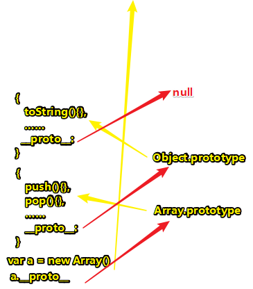
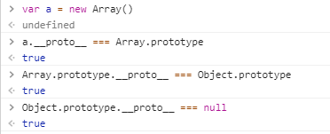
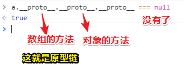
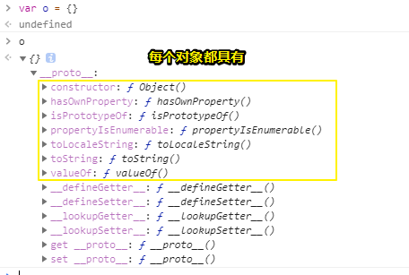
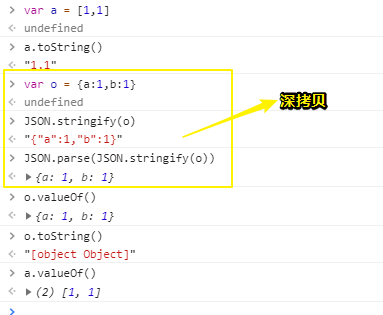

# 3.4.7  Object 类型

## ★对象

### ◇概念

> ECMAScript 中的对象其实就是一组**数据和功能**的**集合**。

之前一直都叫对象为哈希表啊！可以称为hash！

### ◇如何创建？

> 对象可以通过执行 **new** 操作符后跟要创建的**对象类型的名称**来创建。而创建 Object 类型的实例并为其添加属性和（或）方法，就可以**创建自定义对象**，如下所示：

```js
var o = new Object();
```

没想到为实例添加些属性和方法，就可以看作是创建自定义对象！你要知道「自定义」这3字总比创建对象这要赤裸裸的说法要高大尚些吧！

好了，话不多说，解释一波，上面这行语句，**✎：**

> 这个语法与 Java 中创建对象的语法相似；但在 ECMAScript 中，如果不给构造函数传递参数，则**可以省略后面的那一对圆括号**。也就是说，在像前面这个示例一样**不传递参数**的情况下，完全可以省略那对圆括号（但这不是推荐的做法）：

```js
var o = new Object; // 有效，但不推荐省略圆括号
```

真是个奇葩的语法啊！毕竟Object是调用了的啊！这省略了真得很奇怪，而且这真得很不好理解demo！

关于new操作符做了什么？之前有了解过，这是Object这个构造函数肚子里隐藏发生的事儿，**✎：**

```js
function Object(xxx) {
    // var temp = {} 1
    // this = temp 2
    // Object.prototype = { constructor: Object}
    // this.__proto__ = Object.prototype 3
    this.XXX = xxx
    // return this 4
}
```

这1、2、3、4注释都是JS 之父帮我们弄的！注意，实际工作中不要出现 `__proto__`这个属性，因为这不是标准属性！

### ◇创建Object实例的用处

> 仅仅创建 Object 的实例并没有什么用处，但关键是要理解一个重要的思想：即在 ECMAScript 中，（就像 Java 中的 java.lang.Object 对象一样） **Object 类型是所有它的实例的基础**。换句话说，Object 类型所具有的任何属性和方法也同样存在于更具体的对象中。

关于这段的理解，我画个图来说明一下，**✎：**



测试一下，我说的是否正确，**✎：**



ps：



### ◇Object的每个实例难道天生丽质？

> Object 的每个实例都具有下列属性和方法。

- constructor ：

  **保存着用于创建当前对象的函数。对于前面的例子而言，构造函数（constructor）就是 Object() 。**

- hasOwnProperty(propertyName) ：

  **用于检查给定的属性在当前对象实例中（而不是在实例的原型中）是否存在。其中，作为参数的属性名（ propertyName ）必须以字符串形式指定（例如： o.hasOwnProperty("name") ）。**

- isPrototypeOf(object) ：

  **用于检查传入的对象是否是当前对象的原型（第 5 章将讨论原型）。**

  ```js
  var a = []
  Array.prototype.isPrototypeOf(a) //true
  ```

  ps：[MDN](https://developer.mozilla.org/zh-CN/docs/Web/JavaScript/Reference/Global_Objects/Object/isPrototypeOf)的描述为 ：

  > `isPrototypeOf()` 方法允许你检查一个对象是否存在于另一个对象的原型链上。

- propertyIsEnumerable(propertyName) ：

  **用于检查给定的属性是否能够使用 for-in 语句（本章后面将会讨论）来枚举。与 hasOwnProperty() 方法一样，作为参数的属性名必须以字符串形式指定。**

- toLocaleString() ：

  **返回对象的字符串表示，该字符串与执行环境的地区对应。**

- toString() ：

  **返回对象的字符串表示。**

- valueOf() ：

  **返回对象的字符串、数值或布尔值表示。通常与 toString() 方法的返回值相同。**

> 由于在 ECMAScript 中 **Object 是所有对象的基础**，因此**所有对象都具有这些基本的属性和方法**。第 5 章和第 6 章将详细介绍 Object 与其他对象的关系。

## ★敲黑板

> 从技术角度讲，ECMA-262 中对象的行为不一定适用于 JavaScript 中的其他对象。
>
> 浏览器环境中的对象，比如 BOM 和 DOM 中的对象，都属于宿主对象，因为它们是由宿主实现提供和定义的。
>
> ECMA-262 不负责定义宿主对象，因此**宿主对象可能会也可能不会继承 Object** 。

## ★总结

- ECMAScript 中的对象其实就是一组**数据和功能**的**集合**。
- ECMA-262 不负责定义宿主对象，因此**宿主对象可能会也可能不会继承 Object** 。
- 

ps：现在constructor的值都指向一个函数了吗？

## ★Q&A

### ①toString()和valueOf()的区别？



**➹：**[关于javascript中的toString()和valueOf() - ershing's - SegmentFault 思否](https://segmentfault.com/a/1190000010824347)


