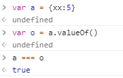
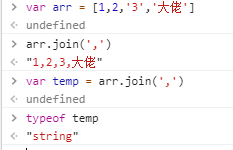
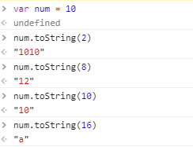
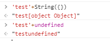
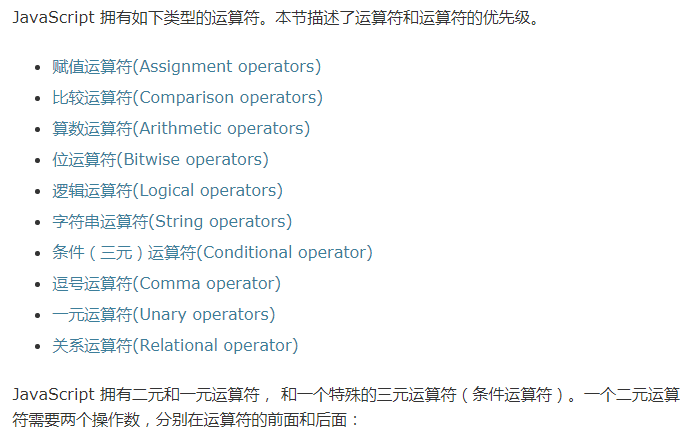

# 3.5 操作符

## ★概念

> ECMA-262 描述了**一组用于操作数据值的操作符**，包括算术操作符（如加号和减号）、位操作符、关系操作符和相等操作符。

**➹：**[表达式和运算符 - JavaScript - MDN](https://developer.mozilla.org/zh-CN/docs/Web/JavaScript/Guide/Expressions_and_Operators)

MDN的翻译为运算符！如果让我理解这个翻译的话，那就是「一组用于计算数据值的符号——运算符」

## ★与众不同的ECMAScript操作符

> ECMAScript 操作符的与众不同之处在于，它们能够适用于很多值，例如字符串、数字值、布尔值，甚至对象。

至于其它语言的操作符是怎样的，我不会去关心！

> 不过，在应用于对象时，相应的操作符通常都会调用对象的 valueOf()和（或） toString() 方法，**以便取得可以操作的值**。

参考这个答案，**✎：**

**➹：**[关于javascript中的toString()和valueOf() - ershing's - SegmentFault 思否](https://segmentfault.com/a/1190000010824347)

做了以下延伸，**✎：**

这两个方法的的用途：

> - toString( ):返回对象的字符串表示。
> - valueOf( ):返回对象的字符串、数值或布尔值表示。

测试方法的运行结果，**✎：**

```js
//先看看toString()方法的结果
var a = 3;
var b = '3';
var c = true;
var d = {test:'123',example:123}
var e = function(){console.log('example');}
var f = ['test','example'];

a.toString();// "3"
b.toString();// "3"
c.toString();// "true"
d.toString();// "[object Object]"
e.toString();// "function (){console.log('example');}"
f.toString();// "test,example"
```

```js
//再看看valueOf()方法的结果
var a = 3;
var b = '3';
var c = true;
var d = {test:'123',example:123}
var e = function(){console.log('example');}
var f = ['test','example'];

a.valueOf();// 3
b.valueOf();// "3"
c.valueOf();// true
d.valueOf();// {test:'123',example:123}
e.valueOf();// function(){console.log('example');}
f.valueOf();// ['test','example']
```

试问valueOf()能否做深拷贝，**✎：**



显然不能哈！

经过这个两个测试例子的比较，可见，**✎：**

> toString( )就是将其他东西用字符串表示，比较特殊的地方就是，表示对象的时候，变成`"[object Object]"`,表示数组的时候，就变成**数组内容以逗号连接的字符串**，相当于`Array.join(',')`。 而valueOf( )就返回它自身了。



这两个方法从它们的返回值来看是很像的，为什么说返回值呢？不说参数呢？因为toString()是可以有参数的，只不过不推荐而已！**✎：**



很多时候，Object的这两个原型方法会让人感到迷惑，那么迷惑在哪儿呢？在于它们在什么时候被调用，**✎：**

```js
var a = '3';
console.log(+a);// 3
```

> 当然了，打印结果是数字3（不是字符串‘3’），因为**一元加操作符**接在字符串前面就将其转换为数字了（字符串转化为数字的一种方式，相当于Number( )方法），但是如果它应用在对象上，过程是怎样的呢，再举例子：

```js
//例子一
var example = {test:'123'};
console.log(+example);// NaN

//例子二 同时改写 toString 和 valueOf 方法
var example = {
    toString:function(){
        return '23';
    },
    valueOf:function(){
        return '32';
    }
};
console.log(+example);// 32

//例子三 只改写 toString 方法
var example = {
    toString:function(){
        return '23';
    }
};
console.log(+example);// 23
```

通过改写方法，来判断，`+`操作符在底层里到底做了什么幺蛾子的调用？

> 通过例子一和例子二的比较，我们可以知道，一元加操作符在操作对象的时候，会先调用对象的valueOf方法来转换，最后再用Number( )方法转换，而通过例子二和例子三的比较，我们可以知道，如果只改写了toString方法，对象则会调用toString方法，**证明valueOf的优先级比toString高**。上面例子是**单独对对象上使用一元加操作符**，但是，如果是字符串加对象呢？

```js
console.log('test'+{});   //"test[object Object]"
```

> 这个很明显，对象和字符串相加，肯定转换为字符串啊，所以调用了对象的toString方法，变为[object Object]了。

我觉得作者这个解释不对啊！应该是调用String方法才对，**✎：**



为什么呢？因为undefined是有效果的，并没有报错哈！当然，String方法的底层是调用toString方法的哈！只是String方法可以对undefined和null搞事情罢了！

好了，接下来看看alert姿势会发生什么幺蛾子的事儿，**✎：**

```js
//例子一
var example = {test:'123'};
alert(example);// "[object Object]"

//例子二 同时改写 toString 和 valueOf 方法
var example = {
    toString:function(){
        return '23';
    },
    valueOf:function(){
        return '32';
    }
};
alert(example);// "23"

//例子三 只改写 valueOf 方法
var example = {
    valueOf:function(){
        return '32';
    }
};
alert(example);// "[object Object]"
```

> 虽然上面结果我用双引号了，但是你知道弹窗不会将字符串的双引号表示出来的。通过上面几个例子，我们就知道了，alert它对待对象，就和字符串和对象相加一样，就是调用它的toString( )方法，和valueOf方法无关。

我认为还是String()，因为undefined和null也能alert！

所以说，字符串+对象、alert(对象)都是调用的是String()，只不过String()的底层是toString()罢了！

> 好了，总结一下，一般用操作符单独对对象进行转换的时候，如果对象存在valueOf或toString改写的话，就先调用改写的方法，valueOf更高级，如果没有被改写，则直接调用对象原型的valueOf方法。如果是弹窗的话，直接调用toString方法。至于其他情况，待续……

还是String方法吧！

## ★Q&A

### ①有哪些运算符呢？

（把能举出来的都举了）



**➹：**[表达式和运算符 - JavaScript - MDN](https://developer.mozilla.org/zh-CN/docs/Web/JavaScript/Guide/Expressions_and_Operators)

### ②生命周期？

**➹：**[关于javascript中的从堆栈内存到执行上下文 – ershing's blog](http://www.ershing.cn/javascript-context/)

这篇文章的延伸，最近了解的Vue的生命周期概念，所以得好好认识以下「生命周期」这4个字！

**➹：**[生命周期 - Wikiwand](https://www.wikiwand.com/zh-hans/%E7%94%9F%E5%91%BD%E9%80%B1%E6%9C%9F)

> 生物学上，**生物生命周期**指得是一个生物体在生命开始到结束周而复始所历经的一系列变化过程。

> **产品生命周期**（product life cycle），简称PLC，**是产品的市场寿命，即一种新产品从开始进入[市场](https://www.wikiwand.com/zh-hans/%E5%B8%82%E5%9C%BA)到被市场淘汰的整个过程。**美国经济学者[弗农·史密斯](https://www.wikiwand.com/zh-hans/%E5%BC%97%E5%86%9C%C2%B7%E5%8F%B2%E5%AF%86%E6%96%AF)（Vernon Lomax Smith）认为：产品生命是指市上的营销生命，产品和人的生命一样，要经历**形成、成长、成熟、衰退**这样的周期。就产品而言，也就是要经历一个开发、引进、成长、成熟、衰退的阶段。而这个周期在不同的技术水平的国家里，发生的时间和过程是不一样的，期间存在一个较大的差距和时差，正是这一时差，表现为不同国家在技术上的差距，它反映了同一产品在不同国家市场上的竞争地位的差异，从而决定了国际贸易和国际投资的变化。

**➹：**[蝉的生命有多长？_百度知道](https://zhidao.baidu.com/question/583482537.html)

我看产品的生命周期就像是周期函数的xy图一样，关于周期函数，**✎：**

> 在[数学](https://www.wikiwand.com/zh-hans/%E6%95%B0%E5%AD%A6)中，**周期函数**是无论任何独立[变量](https://www.wikiwand.com/zh-hans/%E5%8F%98%E9%87%8F)上经过一个确定的**周期**之后数值皆能重复的[函数](https://www.wikiwand.com/zh-hans/%E5%87%BD%E6%95%B0)。我们日常所见的[钟表](https://www.wikiwand.com/zh-hans/%E9%90%98%E9%8C%B6)指针以及[月亮](https://www.wikiwand.com/zh-hans/%E6%9C%88%E4%BA%AE)的[月相](https://www.wikiwand.com/zh-hans/%E6%9C%88%E7%9B%B8)都呈现出周期性的特点。**周期性运动**是系统的运动位置呈现周期性的运动。

**➹：**[周期函数 - Wikiwand](https://www.wikiwand.com/zh-hans/%E5%91%A8%E6%9C%9F%E5%87%BD%E6%95%B0)

总之，涉及到周期，那么就会有阶段之分！不同的阶段一般都会有不同的行为！

### ③夏天知知叫的蝉生命周期是多久阿????

> 蝉的幼虫是在土里七年， 然后孵化出来活七天就死掉了吗? 还是我想错了? 正确是多久呢?

答案，**✎：**

> 蝉儿响亮的鸣叫声就像夏天来临时的歌手，但是你知道牠们是怎么鸣叫的吗？ 是口中发出来的呢？ 还是像螽斯一样，举翅而歌？ 都不对！
>
>  其实蝉是利用位于腹部腹面的发音器发声的，而且只有雄虫具有这种结构，所以也是区别两性最好的特征。 蝉声听多了或许令人心烦，但听在雌蝉的耳里，可是无比的悦耳的情歌喔！ 牠们听到雄蝉的鸣叫之后，便会飞近雄蝉的身边进行交尾，完成传宗接代的任务。 
>
> 蝉的幼年时期是在土中度过的，以植物的根部为食，所以常被人们视为害虫。 蝉的幼期有好几年，以北美洲的十七年蝉为例，牠们的幼虫会在土中生活长达十七年之久，才爬出地面羽化！ 然而牠们的成虫，寿命通常只有两三周，同时只吃些水份树汁来维持生命，在尽情唱着嘹亮的生命之歌后，然后交尾死亡。
>
>  十七年的蛰伏，换来一个月左右的成虫生命，叫牠如何不拼命的大声唱歌呢？ 这是美国的十七年蝉；在台湾，蝉种类多达80种，生活史在1-5年间。

**➹：**[夏天知知叫的蟬生命週期是多久阿???? | Yahoo奇摩知識+](https://tw.answers.yahoo.com/question/index?qid=20060605000013KK05749&guccounter=1)

从解释中受到的启示，**✎：**

- 同样一种行为，有些人看来是厌恶的，而有些人则是欣赏！
- 十七年蝉，低调的活了17年，而这一生，只有一个月左右的时间，让大家知道这世界是有我们的存在的！

虽让人感到遗憾，但能把握现在，却是这一生最值得做，最美好的时刻！而且每一天都是如此！

