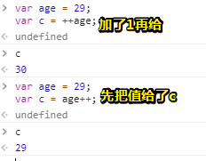
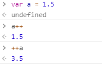
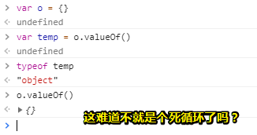
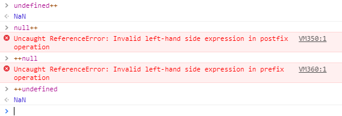
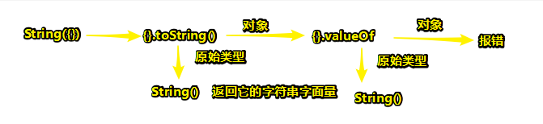

# 3.5.1 一元操作符

## ★概念

> **只能操作一个值的**操作符叫做一元操作符。一元操作符是 ECMAScript 中**最简单的**操作符。

两个特点，一个是操作一个值的，一个是最简单的！

## ★那么，有哪些是一元操作符呢？

### ◇递增和递减操作符

#### 定义及用法

> 递增和递减操作符直接**借鉴自 C**，而且各有两个版本：**前置型和后置型**。顾名思义，前置型应该位于要操作的变量之前，而后置型则应该位于要操作的变量之后。

因此，它就有了以下用法了，**✎：**

##### 前置

> 在使用前置递增操作符给一个数值加 1 时，要把两个加号（++）放在这个数值变量前面，如下所示：

```js
var age = 29;
++age;
```

我调皮了一下，测试了下面demo，**✎：**



此时的age可是30哦！只是在赋值给c的时候，age是29！

言归正传，回到刚才那两句demo，**✎：**

> 在这个例子中，前置递增操作符把 age 的值变成了 30（为 29 加上了 1）。实际上，执行这个前置递增操作与执行以下操作的效果相同：

```js
var age = 29;
age = age + 1;
```

我能说 `++age`是 `age+1`的语法糖吗？不过看起来都是同样的字符数(⊙o⊙)…，只是有点装逼而已！

同理，**✎：**

> 执行前置递减操作的方法也类似，结果会从一个数值中减去 1。使用前置递减操作符时，要把两个减号（ -- ）放在相应变量的前面，如下所示：

```js
var age = 29;
--age;
```

> 这样， age 变量的值就减少为 28（从 29 中减去了 1）。

##### 特点

> 执行前置递增和递减操作时，变量的值都是在语句被求值以前改变的。（在计算机科学领域，这种
> 情况通常被称作副效应。）请看下面这个例子。

ps：这是在说age的结果，先计算好！再去通过计算把结果赋给左边的变量咯！

```js
var age = 29;
var anotherAge = --age + 2;
alert(age); // 输出 28
alert(anotherAge); // 输出 30
```

> 这个例子中变量 anotherAge 的初始值等于变量 age 的值前置递减之后加 2。由于先执行了减法操作， age 的值变成了 28，所以再加上 2 的结果就是 30。

如果我不好理解的话，那么我会，转化一下，**✎：**

```js
var age = 29
age = age - 1 //28
var anotherAge = age+2
```

> 由于前置递增和递减操作与执行语句的优先级相等，因此整个语句会从左至右被求值。再看一个例子：

ps：讲真，什么叫执行语句的优先级？我知道SQL中一个复杂的查询语句可能会有很多的子语句，这时就会有个执行顺序了！那么在这里，我不看它的解释，直接从例子归纳的话，首先赋值语句是从右到左的，即把右边的结果返回给左边的变量！而右边的计算，则是从左往右的，也就是说先计算 `--num1`，然后再加1！

**➹：**[运算符优先级 - JavaScript - MDN](https://developer.mozilla.org/zh-CN/docs/Web/JavaScript/Reference/Operators/Operator_Precedence)

```js
var num1 = 2;
var num2 = 20;
var num3 = --num1 + num2; // 等于 21
var num4 = num1 + num2; // 等于 21
```

> 在这里， num3 之所以等于 21 是因为 num1 先减去了 1 才与 num2 相加。而变量 num4 也等于 21 是
> 因为相应的加法操作使用了 num1 减去 1 之后的值。

##### 后置

> 后置型递增和递减操作符的语法不变（仍然分别是 ++ 和 -- ），只不过要**放在变量的后面**而不是前面。

##### 特点

> 后置递增和递减与前置递增和递减有一个非常重要的区别，即**递增和递减操作是在包含它们的语句被求值之后才执行的**。这个区别在某些情况下不是什么问题，例如：

ps：突然有点明白了，也就是说是在赋值操作执行后，这个age++的age才会被加上1，得到一个加了1的age咯！然而此时赋值已经结束了，即便你想回头也不能回头了！

```js
var age = 29;
age++;
```

> 把递增操作符放在变量后面并不会改变语句的结果，因为**递增是这条语句的唯一操作**。但是，当**语句中还包含其他操作**时，上述区别就会非常明显了。请看下面的例子：

```js
var num1 = 2;
var num2 = 20;
var num3 = num1-- + num2; //  等于 22
var num4 = num1 + num2; // 等于 21
```

ps：也就是说num3这行语句求值结束后，放回一个22后，这个num1才开始发生变化咯！所以会直接影响到num4的结果！

我或许可以认为是，**✎：**

```js
var num1 = 2;
var num2 = 20;
var num3 = num1 + num2; //  等于 22
num1 = num1 - 1； // 1
var num4 = num1 + num2; // 等于 21
```

好了，书上的解释是怎样的呢？，**✎：**

> 这里仅仅将前置递减改成了后置递减，就立即可以看到差别。在前面使用前置递减的例子中， num3
> 和 num4 最后都等于 21。而在这个例子中， num3 等于 22， num4 等于 21。差别的根源在于，这里在计
> 算 num3 时使用了 num1 的原始值（2）完成了加法计算，而 num4 则使用了递减后的值（1）。

#### 小结

> 所有**这 4 个操作符对任何值都适用**，也就是它们不仅适用于整数，还可以用于字符串、布尔值、浮点数值和对象。在应用于不同的值时，递增和递减操作符遵循下列规则。

- 在应用于一个**包含有效数字**字符的**字符串**时，先将其转换为**数字值**，再执行加减 1 的操作。字
  符串变量变成数值变量。

- 在应用于一个**不包含有效数字**字符的字符串时，将变量的值设置为 **NaN** （第 4 章将详细讨论）。
  字符串变量变成数值变量。

- 在应用于布尔值 false 时，先将其转换为 0 再执行加减 1 的操作。布尔值变量变成数值变量。

- 在应用于布尔值 true 时，先将其转换为 1 再执行加减 1 的操作。布尔值变量变成数值变量。

- 在应用于浮点数值时，执行加减 1 的操作。

  

- 在应用于对象时，先调用对象的 valueOf() 方法（第 5 章将详细讨论）以取得一个可供操作的
  值。然后对该值应用前述规则。如果结果是 NaN ，则在调用 toString() 方法后再应用前述规
  则。**对象变量变成数值变量**。

讲真，这和Number()一个模样，只是我在想， 你一个空对象如何得到NaN呢？**✎：**




看来这个我就知道了，**✎：**

**➹：**[数据类型的转换 - JavaScript 教程 - 网道](https://wangdoc.com/javascript/features/conversion.html#number)

ps：



以下示例展示了上面的一些规则：

```js
var s1 = "2";
var s2 = "z";
var b = false;
var f = 1.1;
var o = {
valueOf: function() {
return -1;
}
};
s1++; // 值变成数值 3
s2++; // 值变成 NaN
b++; // 值变成数值 1
f--; // 值变成 0.10000000000000009（由于浮点舍入错误所致）
o--; // 值变成数值-2
```

难道真得要自定义一个valueOf()?

### ◇ 一元加和减操作符


## ★总结

- 阮一峰的书适合你在看高程的书遇到不理解的幺蛾子的时候去查看！毕竟它的书的知识点的密度衔接的太多了！

- Number()、String()等这些除了可以做为构造函数之外，还可以用作工具函数

  > - `Number`对象是数值对应的包装对象，可以作为构造函数使用，也可以作为工具函数使用。
  >   - 作为构造函数时，它用于生成值为数值的对象。
  > - 作为工具函数时，它可以将任何类型的值转为数值

  **➹：**[Number对象 -- JavaScript 标准参考教程（alpha）](http://javascript.ruanyifeng.com/stdlib/number.html)


## ★Q&A

### ①副作用？

> In computer science, a function or expression is said to have a **side effect** if, in addition to returning a value, it also modifies some state or has an *observable*interaction with calling functions or the outside world. 

在计算机科学中，如果一个函数或表达式除了返回一个值之外，还修改了某个状态，或者与调用函数或者是与外部世界有可观察到的交互作用，那么它就被认为具有副作用。

也就是说，产生了多余的东西，如依赖了其它东西！

**➹：**[C语言里的side effect是什么意思？ - 知乎](https://www.zhihu.com/question/20068456)

**➹：**[函数副作用 - Wikiwand](https://www.wikiwand.com/zh/%E5%87%BD%E6%95%B0%E5%89%AF%E4%BD%9C%E7%94%A8)

### ②对象转换之String()

> `String`函数可以将任意类型的值转化成字符串，转换规则如下。

**（1）原始类型值**

> - **数值**：转为相应的字符串。
> - **字符串**：转换后还是原来的值。
> - **布尔值**：`true`转为字符串`"true"`，`false`转为字符串`"false"`。
> - **undefined**：转为字符串`"undefined"`。
> - **null**：转为字符串`"null"`。

```js
String(123) // "123"
String('abc') // "abc"
String(true) // "true"
String(undefined) // "undefined"
String(null) // "null"
```

**（2）对象**

> `String`方法的参数如果是对象，返回一个类型字符串；如果是数组，返回该数组的字符串形式。

```js
String({a: 1}) // "[object Object]"
String([1, 2, 3]) // "1,2,3“
```

> `String`方法背后的转换规则，与`Number`方法基本相同，只是互换了`valueOf`方法和`toString`方法的执行顺序。
>
> 1. 先调用对象自身的`toString`方法。如果返回原始类型的值，则对该值使用`String`函数，不再进行以下步骤。
> 2. 如果`toString`方法返回的是对象，再调用原对象的`valueOf`方法。如果`valueOf`方法返回原始类型的值，则对该值使用`String`函数，不再进行以下步骤。
> 3. 如果`valueOf`方法返回的是对象，就报错。
>
> 下面是一个例子。

```js
String({a: 1})
// "[object Object]"

// 等同于
String({a: 1}.toString())
// "[object Object]"
```

> 上面代码先调用对象的`toString`方法，发现返回的是字符串`[object Object]`，就不再调用`valueOf`方法了。
>
> 如果`toString`法和`valueOf`方法，返回的都是对象，就会报错。

```js
var obj = {
  valueOf: function () {
    return {};
  },
  toString: function () {
    return {};
  }
};

String(obj)
// TypeError: Cannot convert object to primitive value
```



> 下面是通过自定义`toString`方法，改变返回值的例子。

```js
String({
  toString: function () {
    return 3;
  }
})
// "3"

String({
  valueOf: function () {
    return 2;
  }
})
// "[object Object]"

String({
  valueOf: function () {
    return 2;
  },
  toString: function () {
    return 3;
  }
})
// "3"
```

> 上面代码对三个对象使用`String`函数。第一个对象返回`toString`方法的值（数值3），第二个对象返回的还是`toString`方法的值（`[object Object]`），第三个对象表示`toString`方法先于`valueOf`方法执行。

补充一个`Object.prototype.toString()`，**✎：**

**➹：**[Object.prototype.toString() - JavaScript - MDN](https://developer.mozilla.org/zh-CN/docs/Web/JavaScript/Reference/Global_Objects/Object/toString)

没有想到可以使用`toString()`检测对象类型啊！

```js
var toString = Object.prototype.toString;

toString.call(new Date); // [object Date]
toString.call(new String); // [object String]
toString.call(Math); // [object Math]

//Since JavaScript 1.8.5
toString.call(undefined); // [object Undefined]
toString.call(null); // [object Null]
```

传递要检查的对象作为第一个参数，称为`thisArg`。

### ③火狐的JavaScript版本是多少？

引子，**✎：**

> 从JavaScript1.8.5开始`toString()`调用 [`null`](https://developer.mozilla.org/zh-CN/docs/Web/JavaScript/Reference/Global_Objects/null)返回`[object *Null*]`，[`undefined`](https://developer.mozilla.org/zh-CN/docs/Web/JavaScript/Reference/Global_Objects/undefined) 返回`[object Undefined]`，如第5版的ECMAScript和随后的Errata。请参阅[使用`toString()`检测对象类型](https://developer.mozilla.org/zh-CN/docs/Web/JavaScript/Reference/Global_Objects/Object/toString#Using_toString()_to_detect_object_class)

**➹：**[Mozilla 对 ECMAScript 6 的支持 - JavaScript - MDN](https://developer.mozilla.org/zh-CN/docs/Web/JavaScript/New_in_JavaScript/ECMAScript_6_support_in_Mozilla)

