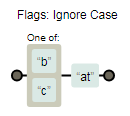

# RegExp类型

正则，真让人抓狂！不过它真得很强大。目前对正则的认识是，**✎：**

1. 查找
2. 替换

regexp的读音可不是连读的，而是一个字母一个字母来读的！

## ★初认识

> ECMAScript 通过 **RegExp 类型**来支持正则表达式

### ◇如何创建一个正则表达式？

```js
var expression = / pattern / flags ;
```

这种语法类似[Perl](https://zh.wikipedia.org/wiki/Perl)的语法！

解释一波，**✎：**

1. 模式（pattern）部分可以是**任何简单或复杂的**正则表达式，可以包含**字符类、限定符、分组、向前查找**以及**反向引用**。

   老实说，限定符、向前查找、反向引用是什么鬼啊！？？？

2. 每个正则表达式都可带有**一或多个**标志（flags），**用以标明正则表达式的行为**

### ◇正则表达式的匹配模式支持哪些标志？

难道还有其它模式？就一个匹配模式吧，看看MDN就知道了，**✎：**

**➹：**[正则表达式 - JavaScript | MDN](https://developer.mozilla.org/zh-CN/docs/Web/JavaScript/Guide/Regular_Expressions)

> 正则表达式是用于匹配字符串中字符组合的模式

简言之，**✎：**

> **正则表达式是一种描述性的语言, 用来概括一类字符串 (或者说一个字符串集合)**

好了，话不多说……

支持3个标志！有一下这些，**✎：**

- g ：表示**全局（global）模式**，即模式将被**应用于所有字符串**，而**非**在发现**第一个**匹配项时**立即停止**

- i ：表示**不区分大小写**（case-insensitive）模式，即**在确定匹配项时忽略模式与字符串的大小写**
- m ：表示**多行（multiline）模式**，即在到达一行文本末尾时还会继续查找**下一行中是否存在与模式匹配的项**

不是说好一个匹配模式吗？好吧！我脑补一下好了，这3个标志作为匹配模式的外延好了！话说回来这个m标志是什么情况！不懂，只能看看后文有没有具体的例子解释了！

### ◇敲黑板

根据上面两点，描绘出正则表达式的样子，**✎：**

> 一个正则表达式就是**一个模式**与上述 **3 个标志**的**组合体**

模式（pattern）则是简单或者复杂的正则表达式，而标志就有明确的3个了。

在这里我理解所谓的模式的姿势是：按照这个描述的规则去给我找到对应的字符。而标志则是标明正则表达式的行为，如大小写需不需要考虑？我遇到一个符合的字符串我就不继续找了吗？……这是站在正则表达式的角度去思考的！

为此，**不同组合产生不同结果**，**✎：**

```js
/*
* 匹配字符串中所有"at"的实例
*/
var pattern1 = /at/g;

/*
* 匹配第一个"bat"或"cat"，不区分大小写
*/
var pattern2 = /[bc]at/i;

/*
* 匹配所有以"at"结尾的 3 个字符的组合，不区分大小写
*/
var pattern3 = /.at/gi;
```

它们各自对应的可视化图，**✎：**





关于元字符，**✎：**

> 与其他语言中的正则表达式类似，模式中使用的所有元字符都必须转义。

当你想匹配元字符的时候，这意味着上面的 `[]`、`.`都得转义啊！

那么有哪些元字符呢？**✎：**

> 正则表达式中的元字符包括：`( [ { \ ^ $ | ) ? * + .]}`

也就是 

- 括号类的：圆/方/花括号
- 杠类的：反斜杠、`|`（正杠？）
- 杂乱的：`^`、`？`、`$`、`.`
- 运算类的：`*`、`+`

总共14个！

注意，**✎：**

> 这些元字符在正则表达式中都有**一或多种特殊用途**，因此如果想要**匹配字符串中包含的这些字符**，就必须对它们进行**转义**

竟然有一或多种用途！

举例子，**✎：**

```js
/*
* 匹配第一个"bat"或"cat"，不区分大小写
*/
var pattern1 = /[bc]at/i;
/*
* 匹配第一个" [bc]at"，不区分大小写
*/
var pattern2 = /\[bc\]at/i;
```

这是pattern2的图，**✎：**


```js
/*
* 匹配所有以"at"结尾的 3 个字符的组合，不区分大小写
*/
var pattern3 = /.at/gi;
/*
* 匹配所有".at"，不区分大小写
*/
var pattern4 = /\.at/gi;
```

这是pattern4的图，**✎：**


ps：对于 pattern3 来说，句点表示位于 "at" 之前的任意一个可以构成匹配项的字符

对了，以上这些demo例子，都是以**字面量**形式来定义的正则表达式


## ★小结

## ★Q&A

### ①Perl？

**➹：**[Perl - 维基百科，自由的百科全书](https://zh.wikipedia.org/wiki/Perl)

> **Perl**是[高阶](https://zh.wikipedia.org/wiki/%E9%AB%98%E7%BA%A7%E8%AF%AD%E8%A8%80)、[通用](https://zh.wikipedia.org/wiki/%E9%80%9A%E7%94%A8%E7%BC%96%E7%A8%8B%E8%AF%AD%E8%A8%80)、[解释型](https://zh.wikipedia.org/wiki/%E7%9B%B4%E8%AD%AF%E8%AA%9E%E8%A8%80)、[动态](https://zh.wikipedia.org/wiki/%E5%8A%A8%E6%80%81%E8%AF%AD%E8%A8%80)的[程序语言家族](https://zh.wikipedia.org/wiki/%E7%A8%8B%E5%BC%8F%E8%AA%9E%E8%A8%80)

我看了一下Perl语言的中心思想，摘录了一下这些内容，**✎：**

---

Perl语言的中心思想可以集成为一句话“**TMTOWTDI**”：

> There's More Than One Way To Do It.
> （不只一种方法来做一件事。）

Perl的作者拉里·沃尔建议可以把这个缩写词念成“Tim Toady”。这句话后来被扩充成:

> There's more than one way to do it, but sometimes consistency is not a bad thing either.
> （不只一种方法来做一件事，但有时保持一致也不错。）
>
> - **TIMTOWTDIBSCINABTE**，发音为“Tim Toady Bicarbonate”

另一个Perl程序员常常想起的Perl俗语是：

> Easy things should be easy, and hard things should be possible.
> （简单的事情应该是简单的，复杂的事情应该尽可能地变得简单。）

---

不管如何，这给我的感觉就是富有哲理的！

不知道JavaScript这门语言的中心思想是什么，**✎：**

**➹：**[JavaScript - 维基百科，自由的百科全书](https://zh.wikipedia.org/wiki/JavaScript)

我没有找到答案，好吧！我目前不会去深究这个问题！暂且跳过

还有就是，维基里说到，**✎：**

> 一般来说，完整的JavaScript包括以下几个部分：
>
> - ECMAScript，描述了该语言的语法和基本对象
> - 文档对象模型（[DOM](https://zh.wikipedia.org/wiki/DOM)），描述处理**网页内容**的方法和接口
> - 浏览器对象模型（[BOM](https://zh.wikipedia.org/wiki/%E6%B5%8F%E8%A7%88%E5%99%A8%E5%AF%B9%E8%B1%A1%E6%A8%A1%E5%9E%8B)），描述与**浏览器**进行交互的方法和接口

**我就郁闷了，难道方法和接口不是同一个意思？**

我试着去搜索它的设计哲学，偶遇了一些不错的文章，**✎：**

**➹：**[超大型 JavaScript 应用的设计哲学](https://zhuanlan.zhihu.com/p/35929167)

### ②元字符

> 正则表达式语言由两种基本字符类型组成：原义（正常）文本字符和元字符。元字符使正则表达式具有处理能力。所谓元字符就是指那些在[正则表达式](https://baike.baidu.com/item/%E6%AD%A3%E5%88%99%E8%A1%A8%E8%BE%BE%E5%BC%8F/1700215)中**具有特殊[意义](https://baike.baidu.com/item/%E6%84%8F%E4%B9%89/2581536)的专用字符**，可以用来规定其前导字符（即位于元字符前面的字符）在目标对象中的出现模式。

这难道是正则表达式的独有概念？

我以为是元字符是字符的字符，即比普通字符更抽象！

**➹：**[元字符_百度百科](https://baike.baidu.com/item/%E5%85%83%E5%AD%97%E7%AC%A6)

关于元数据，**✎：**

**➹：**[元数据（MetaData） - 阮一峰的网络日志](http://www.ruanyifeng.com/blog/2007/03/metadata.html)

也就是给一个名字描述这一类的数据，如165cm、175cm，我给个身高描述这一类数据，而身高本身也是数据，所以我可以认为元不元是相对而言的！

关于元数据的好处，**✎：**

> 元数据最大的好处是，它使信息的描述和分类可以实现格式化，从而为机器处理创造了可能。

最近在看视频敲一个「Vue简历制作工具」

其中html是有简介、技能、项目，我可以按照元数据的概念去理解这些，**✎：**

1. 简介、技能、项目就是一个个元数据
2. 简介下还有姓名、邮箱、手机号等这些东西我也可以看作是元数据，当然这是相对于具体实例（如邮箱号为1@163.com）而言的！

总之这给我的感觉就是概括之概括，元之元！这或许就是一种抽象、归纳的能力！简而言之就是分类！

还有html标签也可如此，从html开始分为head和body，html是个根元素，我可以把它看作是「根元」，或者最根本的元元素……

而类的概念也是如此吧！

### ③那14个元字符所表示的意义？

**➹：**[正则表达式 – 元字符 | 菜鸟教程](http://www.runoob.com/regexp/regexp-metachar.html)

